## 看一遍就理解：动态规划详解


### 前言

我们刷 Leetcode 的时候，经常会遇到动态规划类型题目。动态规划问题非常非常经典，也很有技巧性，一般大厂都非常喜欢问。今天跟大家一起来学习动态规划的套路，文章如果有不正确的地方，欢迎大家指出哈，感谢感谢~

- 什么是动态规划？
- 动态规划的核心思想
- 一个例子走进动态规划
- 动态规划的解题套路
- Leetcode 案例分析

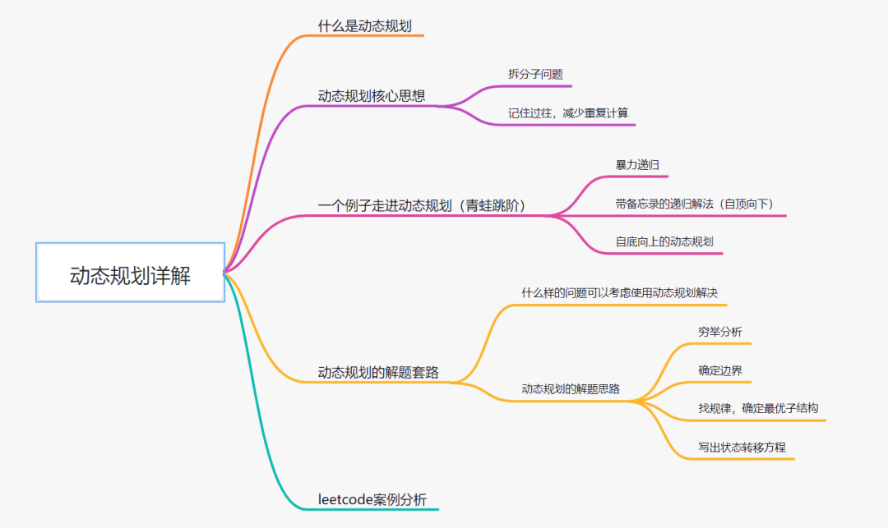


### 什么是动态规划？

动态规划（英语：Dynamic programming，简称 DP），是一种在数学、管理科学、计算机科学、经济学和生物信息学中使用的，通过把原问题分解为相对简单的子问题的方式求解复杂问题的方法。动态规划常常适用于有重叠子问题和最优子结构性质的问题。


> dynamic programming is a method for solving a complex problem by breaking it down into a collection of simpler subproblems.


以上定义来自维基百科，看定义感觉还是有点抽象。简单来说，动态规划其实就是，给定一个问题，我们把它拆成一个个子问题，直到子问题可以直接解决。然后呢，把子问题答案保存起来，以减少重复计算。再根据子问题答案反推，得出原问题解的一种方法。


> 一般这些子问题很相似，可以通过函数关系式递推出来。然后呢，动态规划就致力于解决每个子问题一次，减少重复计算,比如斐波那契数列就可以看做入门级的经典动态规划问题。


### 动态规划核心思想

动态规划最核心的思想，就在于**拆分子问题，记住过往，减少重复计算**。动态规划在于记住过往。


我们来看下，网上比较流行的一个例子：

> 
>
> - A ："1+1+1+1+1+1+1+1 =？"
> - A ："上面等式的值是多少"
> - B ：计算 "8"
> - A :  在上面等式的左边写上 "1+" 呢？
> - A : "此时等式的值为多少"
> - B :  很快得出答案 "9"
> - A : "你怎么这么快就知道答案了"
> - A : "只要在8的基础上加1就行了"
> - A : "所以你不用重新计算，因为你记住了第一个等式的值为8!动态规划算法也可以说是 '记住求过的解来节省时间'"
>
> 

### 一个例子带你走进动态规划 -- 青蛙跳阶问题

#### 暴力递归

> 
>
>  Leetcode 原题：一只青蛙一次可以跳上1级台阶，也可以跳上2级台阶。求该青蛙跳上一个 10 级的台阶总共有多少种跳法。
>
> 

有些小伙伴第一次见这个题的时候，可能会有点蒙圈，不知道怎么解决。其实可以试想：

> 
>
> - 要想跳到第 10 级台阶，要么是先跳到第 9 级，然后再跳 1 级台阶上去；要么是先跳到第 8 级，然后一次迈 2 级台阶上去。
> - 同理，要想跳到第 9 级台阶，要么是先跳到第 8 级，然后再跳 1 级台阶上去；要么是先跳到第 7 级，然后一次迈 2 级台阶上去。
> - 要想跳到第 8 级台阶，要么是先跳到第 7 级，然后再跳 1 级台阶上去；要么是先跳到第 6 级，然后一次迈 2 级台阶上去。
>
> 

假设跳到第n级台阶的跳数我们定义为f(n)，很显然就可以得出以下公式：

```
f（10） = f（9）+f(8)
f (9)  = f(8) + f(7)
f (8)  = f(7) + f(6)
...
f(3) = f(2) + f(1)

即通用公式为: f(n) = f(n-1) + f(n-2)
```

那 f(2) 或者 f(1) 等于多少呢？

- 当只有 2 级台阶时，有两种跳法，第一种是直接跳两级，第二种是先跳一级，然后再跳一级。即 f(2) = 2;
- 当只有1级台阶时，只有一种跳法，即f（1）= 1；

因此可以用递归去解决这个问题：

```
class Solution {
    public int numWays(int n) {
    if(n == 1){
        return 1;
    }
    if(n == 2){
       return 2;
    }
    return numWays(n-1) + numWays(n-2);
    }
}
```

去 Leetcode 提交一下，发现有问题，超出时间限制了

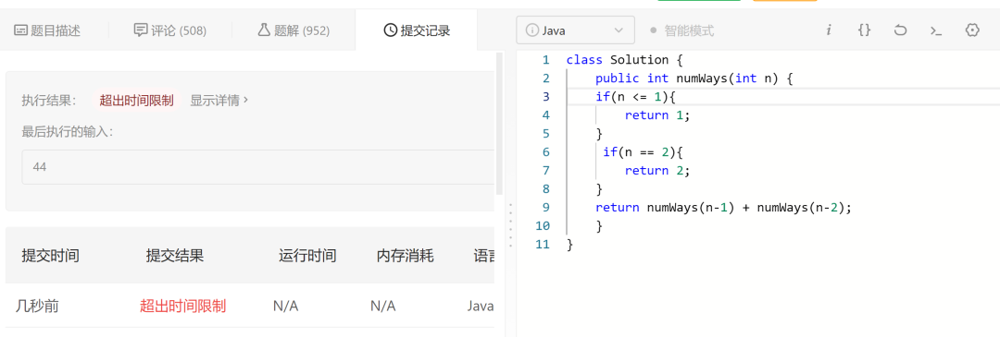

为什么超时了呢？递归耗时在哪里呢？先画出**递归树**看看：

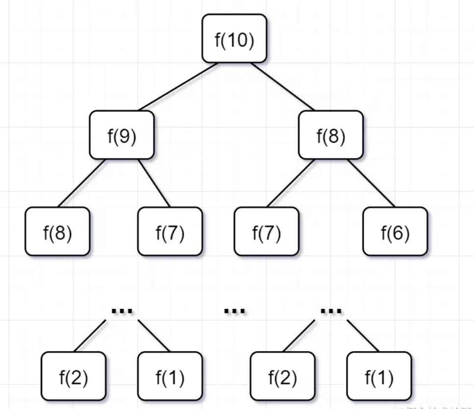

- 要计算原问题 f(10)，就需要先计算出子问题 f(9) 和 f(8)
- 然后要计算 f(9)，又要先算出子问题 f(8) 和 f(7)，以此类推。
- 一直到 f(2) 和 f(1），递归树才终止。

我们先来看看这个递归的时间复杂度吧：

```
递归时间复杂度 = 解决一个子问题时间*子问题个数
```

- 一个子问题时间 =  f（n-1）+f（n-2），也就是一个加法的操作，所以复杂度是 O(1)；
- 问题个数 = 递归树节点的总数，递归树的总节点 = 2^n-1，所以是复杂度O(2^n)。

因此，青蛙跳阶，递归解法的时间复杂度 = O(1) * O(2^n) =  O(2^n)，就是指数级别的，爆炸增长的，如果n比较大的话，超时很正常的了。

回过头来，你仔细观察这颗递归树，你会发现存在大量重复计算，比如f（8）被计算了两次，f（7）被重复计算了3次...所以这个递归算法低效的原因，就是**存在大量的重复计算**！

既然存在大量重复计算，那么我们可以先把计算好的答案存下来，即造一个备忘录，等到下次需要的话，先去备忘录查一下，如果有，就直接取就好了，备忘录没有才开始计算，那就可以省去重新重复计算的耗时啦！这就是带备忘录的解法。

#### 带备忘录的递归解法（自顶向下）

一般使用一个数组或者一个哈希map充当这个**备忘录**。

- 第一步，f（10）= f(9) + f(8)，f(9) 和f（8）都需要计算出来，然后再加到备忘录中，如下：

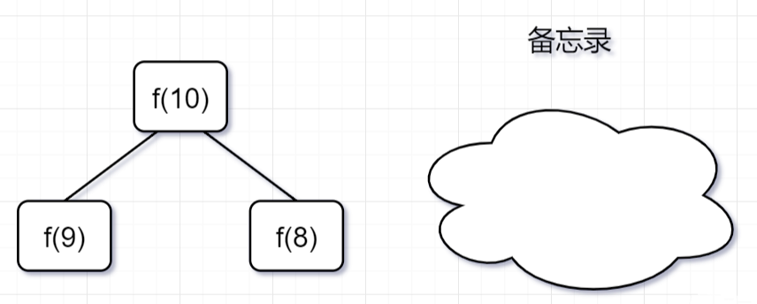

- 第二步，  f(9) = f（8）+ f（7），f（8）= f（7）+ f(6), 因为 f(8) 已经在备忘录中啦，所以可以省掉，f(7),f（6）都需要计算出来，加到备忘录中~

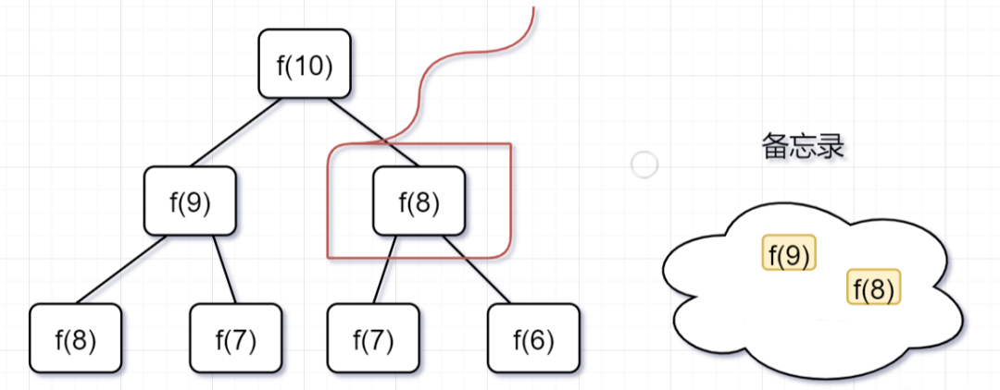

第三步， f(8) = f（7）+ f(6),发现f(8)，f(7),f（6）全部都在备忘录上了，所以都可以剪掉。

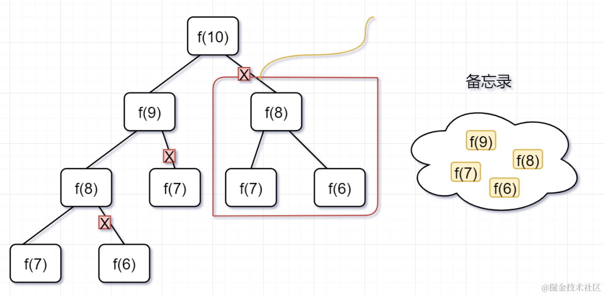

所以呢，用了备忘录递归算法，递归树变成光秃秃的树干咯，如下：

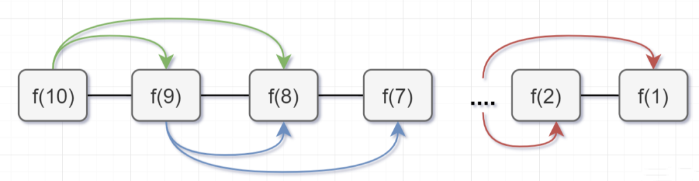

带**备忘录**的递归算法，子问题个数=树节点数=n，解决一个子问题还是O(1),所以带**备忘录**的递归算法的时间复杂度是O(n)。接下来呢，我们用带**备忘录**的递归算法去撸代码，解决这个青蛙跳阶问题的超时问题咯~，代码如下：

```
public class Solution {
    //使用哈希map，充当备忘录的作用
    Map<Integer, Integer> tempMap = new HashMap();
    public int numWays(int n) {
        // n = 0 也算1种
        if (n == 0) {
            return 1;
        }
        if (n <= 2) {
            return n;
        }
        //先判断有没计算过，即看看备忘录有没有
        if (tempMap.containsKey(n)) {
            //备忘录有，即计算过，直接返回
            return tempMap.get(n);
        } else {
            // 备忘录没有，即没有计算过，执行递归计算,并且把结果保存到备忘录map中，对1000000007取余（这个是 Leetcode 题目规定的）
            tempMap.put(n, (numWays(n - 1) + numWays(n - 2)) % 1000000007);
            return tempMap.get(n);
        }
    }
}
```

去 Leetcode 提交一下，如图，稳了：

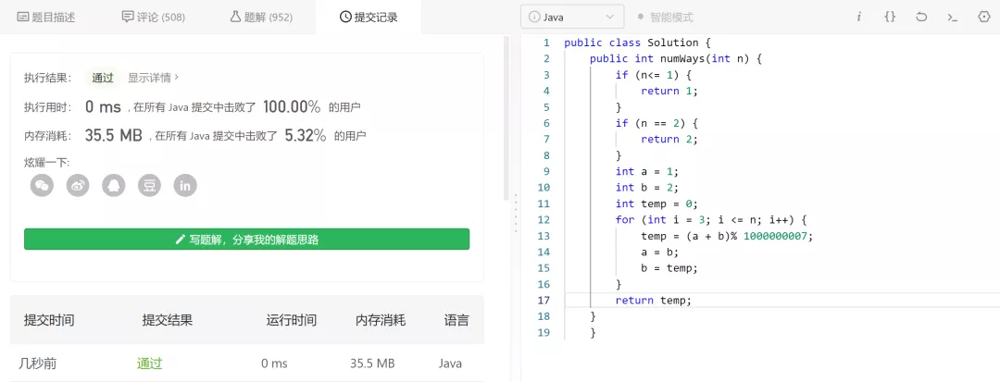

其实，还可以用动态规划解决这道题。

#### 自底向上的动态规划

动态规划跟带备忘录的递归解法基本思想是一致的，都是减少重复计算，时间复杂度也都是差不多。但是呢：

- 带备忘录的递归，是从f(10)往f(1）方向延伸求解的，所以也称为**自顶向下**的解法。
- 动态规划从较小问题的解，由交叠性质，逐步决策出较大问题的解，它是从f(1)往f(10）方向，往上推求解，所以称为**自底向上**的解法。

动态规划有几个典型特征，**最优子结构、状态转移方程、边界、重叠子问题**。在青蛙跳阶问题中：

- f(n-1)和f(n-2) 称为 f(n) 的最优子结构
- f(n)= f（n-1）+f（n-2）就称为状态转移方程
- f(1) = 1, f(2) = 2 就是边界啦
- 比如f(10)= f(9)+f(8),f(9) = f(8) + f(7) ,f(8)就是重叠子问题。

我们来看下自底向上的解法，从f(1)往f(10）方向，想想是不是直接一个for循环就可以解决啦，如下：

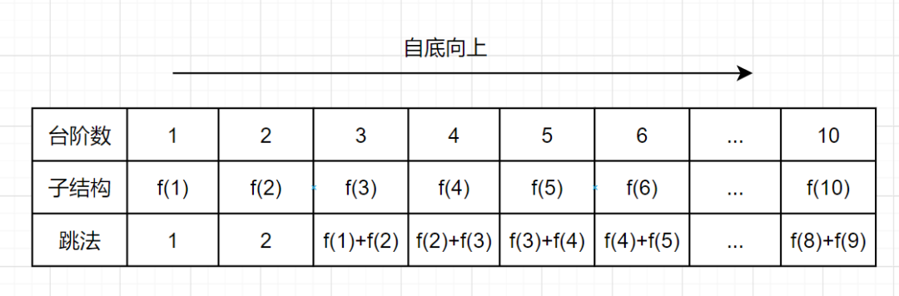

带备忘录的递归解法，空间复杂度是O(n)，但是呢，仔细观察上图，可以发现，f（n）只依赖前面两个数，所以只需要两个变量a和b来存储，就可以满足需求了，因此空间复杂度是O(1)就可以啦

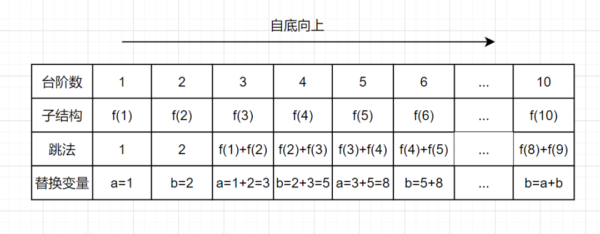

动态规划实现代码如下：

```
public class Solution {
    public int numWays(int n) {
        if (n<= 1) {
            return 1;
        }
        if (n == 2) {
            return 2;
        }
        int a = 1;
        int b = 2;
        int temp = 0;
        for (int i = 3; i <= n; i++) {
            temp = (a + b)% 1000000007;
            a = b;
            b = temp;
        }
        return temp;
    }
}
```

### 动态规划的解题套路

#### 什么样的问题可以考虑使用动态规划解决呢？

> ★
>
> 如果一个问题，可以把所有可能的答案穷举出来，并且穷举出来后，发现存在重叠子问题，就可以考虑使用动态规划。
>
> ”

比如一些求最值的场景，如**最长递增子序列、最小编辑距离、背包问题、凑零钱问题**等等，都是动态规划的经典应用场景。

### 动态规划的解题思路

动态规划的核心思想就是**拆分子问题，记住过往，减少重复计算。** 并且动态规划一般都是自底向上的，因此到这里，基于**青蛙跳阶**问题，我总结了一下我做动态规划的思路：

- 穷举分析
- 确定边界
- 找出规律，确定最优子结构
- 写出状态转移方程

#### 1. 穷举分析

- 当台阶数是1的时候，有一种跳法，f（1） =1
- 当只有2级台阶时，有两种跳法，第一种是直接跳两级，第二种是先跳一级，然后再跳一级。即f(2) = 2;
- 当台阶是3级时，想跳到第3级台阶，要么是先跳到第2级，然后再跳1级台阶上去，要么是先跳到第 1级，然后一次迈 2 级台阶上去。所以f(3) = f(2) + f(1) =3
- 当台阶是4级时，想跳到第3级台阶，要么是先跳到第3级，然后再跳1级台阶上去，要么是先跳到第 2级，然后一次迈 2 级台阶上去。所以f(4) = f(3) + f(2) =5
- 当台阶是5级时......

自底向上的动态规划

#### 2. 确定边界

通过穷举分析，我们发现，当台阶数是1的时候或者2的时候，可以明确知道青蛙跳法。f（1） =1，f(2) = 2，当台阶n>=3时，已经呈现出规律f(3) = f(2) + f(1) =3，因此f（1） =1，f(2) = 2就是青蛙跳阶的边界。

#### 3. 找规律，确定最优子结构

n>=3时，已经呈现出规律 f(n) = f(n-1) + f(n-2) ，因此，f(n-1)和f(n-2) 称为 f(n) 的最优子结构。什么是最优子结构？有这么一个解释：

> ★
>
> 一道动态规划问题，其实就是一个递推问题。假设当前决策结果是f(n),则最优子结构就是要让 f(n-k) 最优,最优子结构性质就是能让转移到n的状态是最优的,并且与后面的决策没有关系,即让后面的决策安心地使用前面的局部最优解的一种性质
>
> ”

#### 4， 写出状态转移方程

通过前面3步，穷举分析，确定边界，最优子结构，我们就可以得出状态转移方程啦：

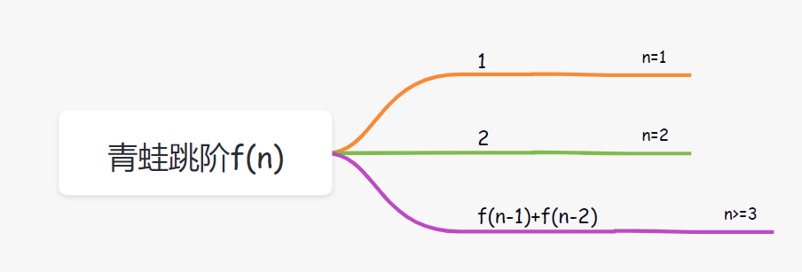

#### 5. 代码实现

我们实现代码的时候，一般注意从底往上遍历哈，然后关注下边界情况，空间复杂度，也就差不多啦。动态规划有个框架的，大家实现的时候，可以考虑适当参考一下：

```
dp[0][0][...] = 边界值
for(状态1 ：所有状态1的值){
    for(状态2 ：所有状态2的值){
        for(...){
          //状态转移方程
          dp[状态1][状态2][...] = 求最值
        }
    }
}
```

###  Leetcode 案例分析

我们一起来分析一道经典 Leetcode 题目吧

> ★
>
> 给你一个整数数组 nums ，找到其中最长严格递增子序列的长度。
>
> ”

示例 1：

```
输入：nums = [10,9,2,5,3,7,101,18]
输出：4
解释：最长递增子序列是 [2,3,7,101]，因此长度为 4 。
```

示例 2：

```
输入：nums = [0,1,0,3,2,3]
输出：4
```

我们按照以上动态规划的解题思路，

- 穷举分析
- 确定边界
- 找规律，确定最优子结构
- 状态转移方程

#### 1.穷举分析

因为动态规划，核心思想包括**拆分子问题，记住过往，减少重复计算。** 所以我们在思考原问题：**数组num[i]的最长递增子序列长度时**，可以思考下**相关子问题**，比如原问题是否跟**子问题**num[i-1]的最长递增子序列长度有关呢？

##### 自底向上的穷举

这里观察规律，显然是有关系的，我们还是遵循动态规划**自底向上**的原则，基于示例1的数据，从数组只有一个元素开始分析。

- 当nums只有一个元素10时，最长递增子序列是[10],长度是1.
- 当nums需要加入一个元素9时，最长递增子序列是[10]或者[9],长度是1。
- 当nums再加入一个元素2时，最长递增子序列是[10]或者[9]或者[2],长度是1。
- 当nums再加入一个元素5时，最长递增子序列是[2,5],长度是2。
- 当nums再加入一个元素3时，最长递增子序列是[2,5]或者[2,3],长度是2。
- 当nums再加入一个元素7时，,最长递增子序列是[2,5,7]或者[2,3,7],长度是3。
- 当nums再加入一个元素101时，最长递增子序列是[2,5,7,101]或者[2,3,7,101],长度是4。
- 当nums再加入一个元素18时，最长递增子序列是[2,5,7,101]或者[2,3,7,101]或者[2,5,7,18]或者[2,3,7,18],长度是4。
- 当nums再加入一个元素7时,最长递增子序列是[2,5,7,101]或者[2,3,7,101]或者[2,5,7,18]或者[2,3,7,18],长度是4.

##### 分析找规律，拆分子问题

通过上面分析，我们可以**发现一个规律**：

如果新加入一个元素nums[i], 最长递增子序列要么**是以nums[i]结尾的递增子序列**，要么就是**nums[i-1]的最长递增子序列**。看到这个，是不是很开心，nums[i]的最长递增子序列已经跟**子问题** nums[i-1]的最长递增子序列有关联了。

```
原问题数组nums[i]的最长递增子序列 = 子问题数组nums[i-1]的最长递增子序列/nums[i]结尾的最长递增子序列
```

是不是感觉成功了一半呢？但是**如何把nums[i]结尾的递增子序列也转化为对应的子问题**呢？要是nums[i]结尾的递增子序列也跟nums[i-1]的最长递增子序列有关就好了。又或者nums[i]结尾的最长递增子序列，跟前面子问题num[j]（0=<j<i）结尾的最长递增子序列有关就好了，带着这个想法，我们又回头看看穷举的过程：

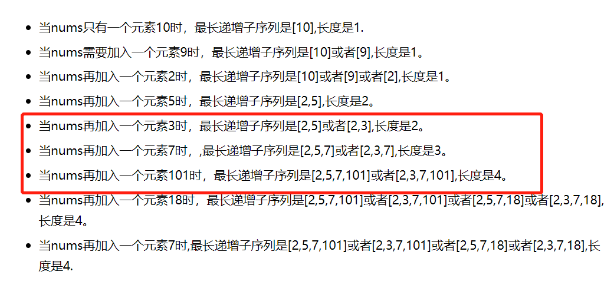

nums[i]的最长递增子序列，不就是**从以数组num[i]每个元素结尾的最长子序列集合，取元素最多（也就是长度最长）那个嘛**，所以原问题，我们转化成求出以数组nums每个元素结尾的最长子序列集合，再取**最大值**嘛。哈哈，想到这，我们就可以**用dp[i]表示以num[i]这个数结尾的最长递增子序列的长度**啦，然后再来看看其中的规律：

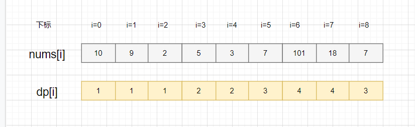

其实，**nums[i] 结尾的自增子序列，只要找到比 nums[i] 小的子序列，加上 nums[i]** 就可以啦。显然，可能形成多种新的子序列，我们选最长那个，就是 dp[i] 的值啦

> ★
>
> - nums[3]=5,以`5`结尾的最长子序列就是`[2,5]`,因为从数组下标`0到3`遍历，只找到了子序列`[2]`比`5`小，所以就是`[2]+[5]`啦，即`dp[4]=2`
> - nums[4]=3,以`3`结尾的最长子序列就是`[2,3]`,因为从数组下标`0到4`遍历，只找到了子序列`[2]`比`3`小，所以就是`[2]+[3]`啦，即`dp[4]=2`
> - nums[5]=7，以`7`结尾的最长子序列就是`[2,5,7]`和`[2,3,7]`,因为从数组下标`0到5`遍历，找到`2,5和3`都比7小，所以就有`[2,7],[5,7],[3,7],[2,5,7]和[2,3,7]`这些子序列，最长子序列就是`[2,5,7]和[2,3,7]`，它俩不就是以`5`结尾和`3`结尾的最长递增子序列+[7]来的嘛！所以，**`dp[5]=3 =dp[3]+1=dp[4]+1`**。
>
> ”

很显然有这个规律：一个以 nums[i] 结尾的数组 nums

- 如果存在 j 属于区间 [0，i-1]，并且 num[i] > num[j] 的话，则有:

  dp(i) = max(dp(j)) + 1

#### 最简单的边界情况

当 nums 数组只有一个元素时，最长递增子序列的长度 dp(1) = 1，当 nums 数组有两个元素时，dp(2) = 2 或者 1， 因此边界就是 dp(1) = 1。

#### 确定最优子结构

从穷举分析，我们可以得出，以下的最优结构：

```
dp(i) = max(dp(j)) + 1，存在 j 属于区间 [0，i-1]，并且 num[i] > num[j]。
```

**max(dp(j))** 就是最优子结构。

#### 状态转移方程

通过前面分析，我们就可以得出状态转移方程啦：


所以数组nums[i]的最长递增子序列就是：

```
最长递增子序列 =max(dp[i])
```


#### 代码实现

```
class Solution {
    public int lengthOfLIS(int[] nums) {
        if (nums.length == 0) {
            return 0;
        }
        int[] dp = new int[nums.length];
        // 初始化就是边界情况
        dp[0] = 1;
        int maxans = 1;
        // 自底向上遍历
        for (int i = 1; i < nums.length; i++) {
            dp[i] = 1;
            // 从下标 0 到 i 遍历
            for (int j = 0; j < i; j++) {
                // 找到前面比 nums[i] 小的数 nums[j]，即有 dp[i] = dp[j] + 1
                if (nums[j] < nums[i]) {
                    // 因为会有多个小于 nums[i] 的数，也就是会存在多种组合了嘛，我们就取最大放到 dp[i]
                    dp[i] = Math.max(dp[i], dp[j] + 1);
                }
            }
            // 求出 dp[i] 后，dp 最大那个就是 nums 的最长递增子序列啦
            maxans = Math.max(maxans, dp[i]);
        }
        return maxans;
    }
}
```