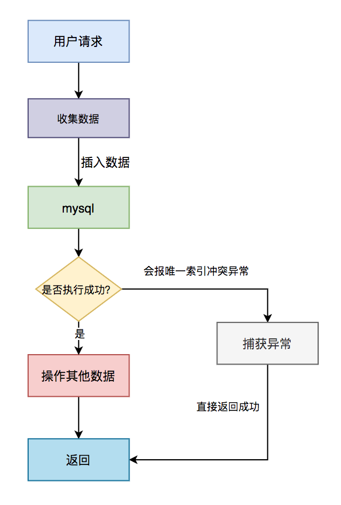
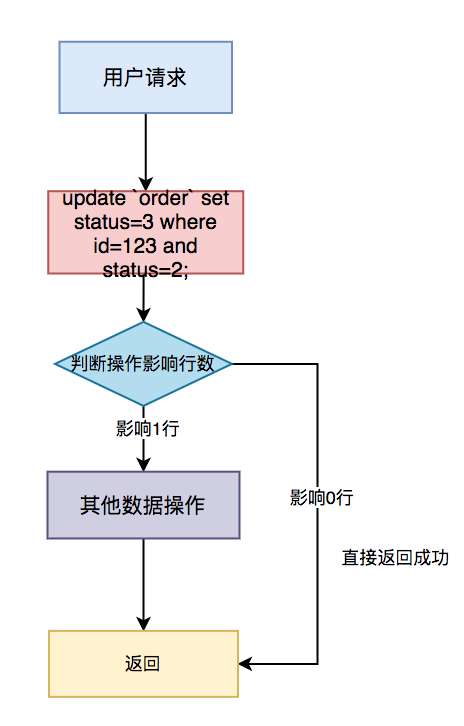
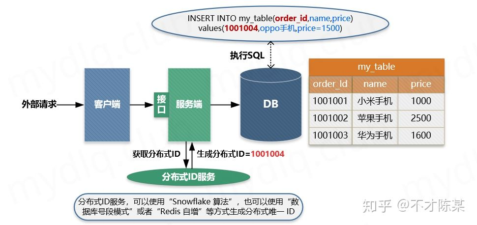

# 前言

`接口幂等性`问题，对于开发人员来说，是一个跟语言无关的公共问题。

本文分享了一些解决这类问题非常实用的办法，绝大部分内容我在项目中实践过的，给有需要的小伙伴一个参考。

不知道你有没有遇到过这些场景：

1. 有时我们在填写某些`form表单`时，保存按钮不小心快速点了两次，表中竟然产生了两条重复的数据，只是 id 不一样。
2. 我们在项目中为了解决`接口超时`问题，通常会引入了`重试机制`。第一次请求接口超时了，请求方没能及时获取返回结果（此时有可能已经成功了），为了避免返回错误的结果（这种情况不可能直接返回失败吧？），于是会对该请求重试几次，这样也会产生重复的数据。
3. MQ 消费者在读取消息时，有时候会读取到`重复消息`（至于什么原因这里先不说，有兴趣的小伙伴，可以找我私聊），如果处理不好，也会产生重复的数据。
4. ……

没错，这些都是幂等性问题。

`接口幂等性`是指用户对于同一操作发起的一次请求或者多次请求的结果是一致的，不会因为多次点击而产生了副作用。

这类问题多发于接口的：

- `insert` 操作，这种情况下多次请求，可能会产生重复数据。
- `update` 操作，如果只是单纯的更新数据，比如：`update user set status=1 where id=1`，是没有问题的。如果还有计算，比如：`update user set status=status+1 where id=1`，这种情况下多次请求，可能会导致数据错误。

那么我们要如何保证接口幂等性？本文将会告诉你答案。


# 幂等思路

## 1. insert 前先 select

通常情况下，在保存数据的接口中，我们为了防止产生重复数据，一般会在`insert`前，先根据`name`或`code`字段`select`一下数据。如果该数据已存在，则执行`update`操作，如果不存在，才执行 `insert`操作。


该方案可能是我们平时在防止产生重复数据时，使用最多的方案。但是该方案不适用于并发场景，在并发场景中，要配合其他方案一起使用，否则同样会产生重复数据。我在这里提一下，是为了避免大家踩坑。

## 2. 加悲观锁

在支付场景中，用户 A 的账号余额有 150 元，想转出 100 元，正常情况下用户 A 的余额只剩 50 元。一般情况下， SQL  是这样的：

```mysql
update user amount = amount-100 where id=123;
```

如果出现多次相同的请求，可能会导致用户 A 的余额变成负数。这种情况，用户 A 可能要哭了。于此同时，系统开发人员可能也要哭了，因为这是很严重的系统 bug。

为了解决这个问题，可以加悲观锁，将用户 A 的那行数据锁住，在同一时刻只允许一个请求获得锁，更新数据，其他的请求则等待。

通常情况下通过如下  SQL  锁住单行数据：

```mysql
select * from user id=123 for update;
```

具体流程如下：


具体步骤：

1. 多个请求同时根据 id 查询用户信息。
2. 判断余额是否不足 100，如果余额不足，则直接返回余额不足。
3. 如果余额充足，则通过 for update 再次查询用户信息，并且尝试获取锁。
4. 只有第一个请求能获取到行锁，其余没有获取锁的请求，则等待下一次获取锁的机会。
5. 第一个请求获取到锁之后，判断余额是否不足 100，如果余额足够，则进行 update 操作。
6. 如果余额不足，说明是重复请求，则直接返回成功。

> 需要特别注意的是：如果使用的是 My SQL  数据库，存储引擎必须用 InnoDB，因为它才支持事务。此外，这里 id 字段一定要是主键或者唯一索引，不然会锁住整张表。

悲观锁需要在同一个事务操作过程中锁住一行数据，如果事务耗时比较长，会造成大量的请求等待，影响接口性能。此外，每次请求接口很难保证都有相同的返回值，所以不适合幂等性设计场景，但是在防重场景中是可以的使用的。

在这里顺便说一下，`防重设计` 和 `幂等设计`，其实是有区别的。防重设计主要为了避免产生重复数据，对接口返回没有太多要求。而幂等设计除了避免产生重复数据之外，还要求每次请求都返回一样的结果。

## 3. 加乐观锁

既然悲观锁有性能问题，为了提升接口性能，我们可以使用乐观锁。需要在表中增加一个`timestamp`或者`version`字段，这里以`version`字段为例。

在更新数据之前先查询一下数据：

```mysql
select id,amount,version from user id=123;
```

如果数据存在，假设查到的`version`等于`1`，再使用`id`和`version`字段作为查询条件更新数据：

```mysql
update user set amount=amount+100,version=version+1
where id=123 and version=1;
```

更新数据的同时`version+1`，然后判断本次`update`操作的影响行数，如果大于 0，则说明本次更新成功，如果等于 0，则说明本次更新没有让数据变更。

由于第一次请求`version`等于`1`是可以成功的，操作成功后`version`变成`2`了。这时如果并发的请求过来，再执行相同的  SQL ：

```mysql
update user set amount=amount+100,version=version+1
where id=123 and version=1;
```

该`update`操作不会真正更新数据，最终 SQL 的执行结果影响行数是`0`，因为`version`已经变成`2`了，`where`中的`version=1`肯定无法满足条件。但为了保证接口幂等性，接口可以直接返回成功，因为`version`值已经修改了，那么前面必定已经成功过一次，后面都是重复的请求。

具体流程如下：


具体步骤：

1. 先根据 id 查询用户信息，包含 version 字段。
2. 根据 id 和 version 字段值作为 where 条件的参数，更新用户信息，同时 version + 1。
3. 判断操作影响行数，如果影响 1 行，则说明是一次请求，可以做其他数据操作。
4. 如果影响 0 行，说明是重复请求，则直接返回成功。

## 4. 加唯一索引

绝大数情况下，为了防止重复数据的产生，我们都会在表中加唯一索引，这是一个非常简单，并且有效的方案。

```mysql
alter table `order` add UNIQUE KEY `un_code` (`code`);
```

加了唯一索引之后，第一次请求数据可以插入成功。但后面的相同请求，插入数据时会报`Duplicate entry '002' for key 'order.un_code`异常，表示唯一索引有冲突。

虽说抛异常对数据来说没有影响，不会造成错误数据。但是为了保证接口幂等性，我们需要对该异常进行捕获，然后返回成功。

如果是`java`程序需要捕获：`DuplicateKeyException`异常，如果使用了`spring`框架还需要捕获：`MySQL IntegrityConstraintViolationException`异常。

具体流程图如下：



具体步骤：

1. 用户通过浏览器发起请求，服务端收集数据。
2. 将该数据插入 MySQL。
3. 判断是否执行成功，如果成功，则操作其他数据（可能还有其他的业务逻辑）。
4. 如果执行失败，捕获唯一索引冲突异常，直接返回成功。

## 5. 建防重表

有时候表中并非所有的场景都不允许产生重复的数据，只有某些特定场景才不允许。这时候，直接在表中加唯一索引，显然是不太合适的。

针对这种情况，我们可以通过`建防重表`来解决问题。

该表可以只包含两个字段：`id` 和 `唯一索引`，唯一索引可以是多个字段比如：name、code 等组合起来的唯一标识，例如：susan_0001。

具体流程图如下：


具体步骤：

1. 用户通过浏览器发起请求，服务端收集数据。
2. 将该数据插入 MySQL 防重表。
3. 判断是否执行成功，如果成功，则做 MySQL 其他的数据操作（可能还有其他的业务逻辑）。
4. 如果执行失败，捕获唯一索引冲突异常，直接返回成功。

> 需要特别注意的是：防重表和业务表必须在同一个数据库中，并且操作要在同一个事务中。

## 6. 根据状态机

很多时候业务表是有状态的，比如订单表中有：1-下单、2-已支付、3-完成、4-撤销等状态。如果这些状态的值是有规律的，按照业务节点正好是从小到大，我们就能通过它来保证接口的幂等性。

假如 id=123 的订单状态是`已支付`，现在要变成`完成`状态。

```text
update `order` set status=3 where id=123 and status=2;
```

第一次请求时，该订单的状态是`已支付`，值是`2`，所以该`update`语句可以正常更新数据， SQL 执行结果的影响行数是`1`，订单状态变成了`3`。

后面有相同的请求过来，再执行相同的 SQL 时，由于订单状态变成了`3`，再用`status=2`作为条件，无法查询出需要更新的数据，所以最终 SQL 执行结果的影响行数是`0`，即不会真正的更新数据。但为了保证接口幂等性，影响行数是`0`时，接口也可以直接返回成功。

具体流程图如下：





具体步骤：

1. 用户通过浏览器发起请求，服务端收集数据。
2. 根据 id 和当前状态作为条件，更新成下一个状态
3. 判断操作影响行数，如果影响了 1 行，说明当前操作成功，可以进行其他数据操作。
4. 如果影响了 0 行，说明是重复请求，直接返回成功。

> 主要特别注意的是，该方案仅限于要更新的`表有状态字段`，并且刚好要更新`状态字段`的这种特殊情况，并非所有场景都适用。

## 7. 加分布式锁

其实前面介绍过的`加唯一索引`或者`加防重表`，本质是使用了`数据库`的`分布式锁`，也属于分布式锁的一种。但由于`数据库分布式锁`的性能不太好，我们可以改用：`Redis`或`zookeeper`。

鉴于现在很多公司分布式配置中心改用`apollo`或`nacos`，已经很少用`zookeeper`了，我们以`Redis`为例介绍分布式锁。

目前主要有三种方式实现 Redis 的分布式锁：

1. setNx 命令
2. set 命令
3. Redission 框架

每种方案各有利弊，具体实现细节我就不说了，有兴趣的朋友可以加我微信找我私聊。

具体流程图如下：


具体步骤：

1. 用户通过浏览器发起请求，服务端会收集数据，并且生成订单号 code 作为唯一业务字段。
2. 使用 Redis 的 set 命令，将该订单 code 设置到 Redis 中，同时设置超时时间。
3. 判断是否设置成功，如果设置成功，说明是第一次请求，则进行数据操作。
4. 如果设置失败，说明是重复请求，则直接返回成功。

> 需要特别注意的是：分布式锁一定要设置一个合理的过期时间，如果设置过短，无法有效的防止重复请求。如果设置过长，可能会浪费`Redis`的存储空间，需要根据实际业务情况而定。

## 8. 获取 token

除了上述方案之外，还有最后一种使用`token`的方案。该方案跟之前的所有方案都有点不一样，需要两次请求才能完成一次业务操作。

1. 第一次请求获取`token`
2. 第二次请求带着这个`token`，完成业务操作。

具体流程图如下：

第一步，先获取 `token`。


第二步，做具体业务操作。


具体步骤：

1. 用户访问页面时，浏览器自动发起获取 token 请求。
2. 服务端生成 token，保存到 Redis 中，然后返回给浏览器。
3. 用户通过浏览器发起请求时，携带该 token。
4. 在 Redis 中查询该 token 是否存在，如果不存在，说明是第一次请求，做则后续的数据操作。
5. 如果存在，说明是重复请求，则直接返回成功。
6. 在 Redis 中 token 会在过期时间之后，被自动删除。

以上方案是针对幂等设计的。


# 项目实践


**什么是幂等性？**

**幂等**是一个数学与计算机学概念，在数学中某一元运算为幂等时，其作用在任一元素两次后会和其作用一次的结果相同。

> 在计算机中编程中，一个幂等操作的特点是其任意多次执行所产生的影响均与一次执行的影响相同。

幂等函数或幂等方法是指可以使用相同参数重复执行，并能获得相同结果的函数。这些函数不会影响系统状态，也不用担心重复执行会对系统造成改变。


**什么是接口幂等性？**

在`HTTP/1.1`中，对幂等性进行了定义。**它描述了一次和多次请求某一个资源对于资源本身应该具有同样的结果**（网络超时等问题除外），即第一次请求的时候对资源产生了副作用，但是以后的多次请求都不会再对资源产生副作用。

这里的副作用是不会对结果产生破坏或者产生不可预料的结果。也就是说，其任意多次执行对资源本身所产生的影响均与一次执行的影响相同。


**为什么需要实现幂等性？**

在接口调用时一般情况下都能正常返回信息不会重复提交，不过在遇见以下情况时可以就会出现问题，如：

**前端重复提交表单**： 在填写一些表格时候，用户填写完成提交，很多时候会因网络波动没有及时对用户做出提交成功响应，致使用户认为没有成功提交，然后一直点提交按钮，这时就会发生重复提交表单请求。

**用户恶意进行刷单**： 例如在实现用户投票这种功能时，如果用户针对一个用户进行重复提交投票，这样会导致接口接收到用户重复提交的投票信息，这样会使投票结果与事实严重不符。

**接口超时重复提交**：很多时候 HTTP 客户端工具都默认开启超时重试的机制，尤其是第三方调用接口时候，为了防止网络波动超时等造成的请求失败，都会添加重试机制，导致一个请求提交多次。

**消息进行重复消费**： 当使用 MQ 消息中间件时候，如果发生消息中间件出现错误未及时提交消费信息，导致发生重复消费。
 “ 使用幂等性最大的优势在于使接口保证任何幂等性操作，免去因重试等造成系统产生的未知的问题。


**引入幂等性后对系统有什么影响？**

幂等性是为了简化客户端逻辑处理，能放置重复提交等操作，但却增加了服务端的逻辑复杂性和成本，其主要是：

- 把并行执行的功能改为串行执行，降低了执行效率。
- 增加了额外控制幂等的业务逻辑，复杂化了业务功能；

所以在使用时候需要考虑是否引入幂等性的必要性，根据实际业务场景具体分析，除了业务上的特殊要求外，一般情况下不需要引入的接口幂等性。


**Restful API 接口幂等性如何？**

现在流行的 Restful 推荐的几种 HTTP 接口方法中，分别存在幂等行与不能保证幂等的方法，如下：

`√`满足幂等

`x` 不满足幂等

`-` 可能满足也可能不满足幂等，根据实际业务逻辑有关


| 方法类型 | 是否幂等 | 描述 |
| :------- | :---------------- | --------------------------- |
| Get      | `√`      | Get 方法用于获取资源。一般不会也不应当对系统资源进行改变，所以是幂等的。 |
| Post     | `x`      | Post 方法一般用于创建新的资源。每次执行都会新增数据，所以不是幂等的。 |
| Put      | `-`      | Put 方法一般用于修改资源。该操作分情况来判断是不是满足幂等，更新操作中直接根据某个值进行更新能保持幂等。执行累加操作的更新是非幂等。 |
| Delete   | `-`      | Delete 方法一般用于删除资源。该操作分情况来判断是不是满足幂等，当根据唯一值进行删除时，删除同一个数据多次执行效果一样。不过需要注意，带查询条件的删除则不一定满足幂等了。 |

Delete：例如在根据条件删除一批数据后，这是新增了一条数据也满足条件，然后又执行了一次删除，那么将会导致新增加的这条满足条件数据也被删除。


## 方案一：数据库唯一主键如何实现幂等性？

数据库**唯一主键**的实现主要是利用数据库中主键唯一约束的特性，一般来说唯一主键比较适用于"插入”时的幂等性，其能保证一张表中只能存在一条带该唯一主键的记录。

使用数据库唯一主键完成幂等性时需要注意的是，该主键一般来说并不是使用数据库中自增主键，而是使用分布式 ID 充当主键，这样才能能保证在分布式环境下 ID 的全局唯一性。


**适用操作**

- 插入操作

- 删除操作


**使用限制**

- 需要生成全局唯一主键 ID；


**主要流程**





主要流程如下：

1. 客户端执行创建请求，调用服务端接口。
2. 服务端执行业务逻辑，生成一个分布式 `ID`，将该 ID 充当待插入数据的主键，然后执数据插入操作，运行对应的 `SQL` 语句。
3. 服务端将该条数据插入数据库中，如果插入成功则表示没有重复调用接口。如果抛出主键重复异常，则表示数据库中已经存在该条记录，返回错误信息到客户端。


## 方案二：数据库乐观锁如何实现幂等性？

数据库乐观锁方案一般只能适用于执行**更新操作**的过程，我们可以提前在对应的数据表中多添加一个字段，充当当前数据的版本标识。

这样每次对该数据库该表的这条数据执行更新时，都会将该版本标识作为一个条件，值为上次待更新数据中的版本标识的值。


**适用操作**

- 更新操作


**使用限制**

- 需要数据库对应业务表中添加额外字段


**描述示例**


例如，存在如下的数据表中：


为了每次执行更新时防止重复更新，确定更新的一定是要更新的内容，我们通常都会添加一个 `version` 字段记录当前的记录版本，这样在更新时候将该值带上，那么只要执行更新操作就能确定一定更新的是某个对应版本下的信息。


这样每次执行更新时候，都要指定要更新的版本号，如下操作就能准确更新 `version=5` 的信息：

```mysql
UPDATE my_table SET price=price+50,version=version+1 WHERE id=1 AND version=5
```

上面 `WHERE` 后面跟着条件 `id=1 AND version=5` 被执行后，`id=1` 的 `version` 被更新为 `6`，所以如果重复执行该条 SQL 语句将不生效，因为 `id=1 AND version=5` 的数据已经不存在，这样就能保住更新的幂等，多次更新对结果不会产生影响。


## 方案三：防重 Token 令牌如何实现幂等性？

针对客户端连续点击或者调用方的超时重试等情况，例如提交订单，此种操作就可以用 `Token` 的机制实现防止重复提交。简单的说就是调用方在调用接口的时候先向后端请求一个全局 `ID（Token）`，请求的时候携带这个全局 `ID` 一起请求（`Token` 最好将其放到 `Headers` 中），后端需要对这个 `Token` 作为 `Key`，用户信息作为 `Value` 到 `Redis` 中进行键值内容校验，如果 `Key` 存在且 `Value` 匹配就执行删除命令，然后正常执行后面的业务逻辑。如果不存在对应的 `Key` 或 `Value` 不匹配就返回重复执行的错误信息，这样来保证幂等操作。


**适用操作**

- 插入操作

- 更新操作

- 删除操作


**使用限制**

- 需要生成全局唯一 `Token` 串

- 需要使用第三方组件 `Redis` 进行数据效验


**主要流程：**


1. 服务端提供获取 Token 的接口，该 Token 可以是一个序列号，也可以是一个分布式 `ID` 或者 `UUID` 串。

2. 客户端调用接口获取 Token，这时候服务端会生成一个 Token 串。

3.  然后将该串存入 Redis 数据库中，以该 Token 作为 Redis 的键（注意设置过期时间)。

4. 将 Token 返回到客户端，客户端拿到后应存到表单隐藏域中。

5. 客户端在执行提交表单时，把 Token 存入到 `Headers` 中，执行业务请求带上该 `Headers`。

6. 服务端接收到请求后从 `Headers` 中拿到 Token，然后根据 Token 到 Redis 中查找该 `key` 是否存在。

7. 服务端根据 Redis 中是否存该 `key` 进行判断，如果存在就将该 `key` 删除，然后正常执行业务逻辑。如果不存在就抛异常，返回重复提交的错误信息。

   > 注意，在并发情况下，执行 Redis 查找数据与删除需要保证原子性，否则很可能在并发下无法保证幂等性。
   >
   > 其实现方法可以使用分布式锁或者使用 `Lua` 表达式来注销查询与删除操作。 


## 方案四: 下游传递唯一序列号如何实现幂等性？

所谓**请求序列号**，其实就是每次向服务端请求时候附带一个短时间内唯一不重复的序列号，该序列号可以是一个**有序 `ID`**，也可以是一个**订单号**，一般由下游生成，在调用上游服务端接口时附加该序列号和用于认证的 `ID`。

当上游服务器收到请求信息后拿取该 **序列号** 和下游 **认证ID** 进行组合，形成用于操作 Redis 的 `Key`，然后到 Redis 中查询是否存在对应的 `Key` 的键值对，根据其结果：

**如果存在**，就说明已经对该下游的该序列号的请求进行了业务处理，这时可以直接响应重复请求的错误信息。

**如果不存在**，就以该 `Key` 作为 Redis 的键，以下游关键信息作为存储的值（例如下游商传递的一些业务逻辑信息），将该键值对存储到 Redis 中 ，然后再正常执行对应的业务逻辑即可。


**适用操作**

- 插入操作

- 更新操作

- 删除操作


**使用限制**

- 要求第三方传递唯一序列号；

- 需要使用第三方组件 Redis 进行数据效验；


**主要流程**


1. 下游服务生成分布式 `ID` 作为序列号，然后执行请求调用上游接口，并附带**唯一序列号**与请求的**认证凭据ID**。

2. 上游服务进行安全效验，检测下游传递的参数中是否存在**序列号**和**凭据ID**。

3. 上游服务到 Redis 中检测是否存在对应的**序列号**与**认证ID**组成的 `Key`，如果存在就抛出重复执行的异常信息，然后响应下游对应的错误信息。如果不存在就以该**序列号**和**认证ID**组合作为 `Key`，以下游关键信息作为 `Value`，进而存储到 Redis 中，然后正常执行接来来的业务逻辑。

   > 上面步骤中插入数据到 Redis 一定要设置过期时间。这样能保证在这个时间范围内，如果重复调用接口，则能够进行判断识别。如果不设置过期时间，很可能导致数据无限量的存入 Redis，致使 Redis 不能正常工作。


**实现接口幂等示例**

这里使用防重 Token 令牌方案，该方案能保证在不同请求动作下的幂等性，实现逻辑可以看上面写的”防重 Token 令牌”方案，接下来写下实现这个逻辑的代码。

**1. Maven 引入相关依赖**

这里使用 `Maven` 工具管理依赖，这里在 `pom.xml`中引入 `SpringBoot`、`Redis`、`lombok` 相关依赖。

```xml
    <dependencies>
        <!--springboot web-->
        <dependency>
            <groupId>org.springframework.boot</groupId>
            <artifactId>spring-boot-starter-web</artifactId>
        </dependency>
        <!--springboot data redis-->
        <dependency>
            <groupId>org.springframework.boot</groupId>
            <artifactId>spring-boot-starter-data-redis</artifactId>
        </dependency>
        <dependency>
            <groupId>org.apache.commons</groupId>
            <artifactId>commons-pool2</artifactId>
        </dependency>
        <!--lombok-->
        <dependency>
            <groupId>org.projectlombok</groupId>
            <artifactId>lombok</artifactId>
        </dependency>
    </dependencies>
```


**2. 配置连接 Redis 的参数**

在 `application` 配置文件中配置连接 `Redis` 的参数，如下:

```yml
spring:  
	redis:    
		ssl: false    
		host: 127.0.0.1    
		port: 6379    
		database: 0    
		timeout: 1000    
		password:    
		lettuce:      
			pool:        
				max-active: 100        
				max-wait: -1        
				min-idle: 0        
				max-idle: 20
```


**3. 创建与验证 Token 工具类**

创建用于操作 Token 相关的 Service 类，里面存在 Token 创建与验证方法，其中：

`Token` 创建方法： 使用 `UUID` 工具创建 `Token` 串，设置以 `“idempotent_token:“+“Token串”` 作为 `Key`，以用户信息当成 `Value`，将信息存入 Redis 中。

`Token` 验证方法： 接收 Token 串参数，加上 Key 前缀形成 `Key`，再传入 `value` 值，执行 `Lua` 表达式（`Lua` 表达式能保证命令执行的原子性）进行查找对应 `Key` 与删除操作。执行完成后验证命令的返回结果，如果结果不为空且非0，则验证成功，否则失败。

```java
@Slf4j
@Service
public class TokenUtilService {

    @Autowired
    private StringRedisTemplate redisTemplate;

    /**
     * 存入 Redis 的 Token 键的前缀
     */
    private static final String IDEMPOTENT_TOKEN_PREFIX = "idempotent_token:";

    /**
     * 创建 Token 存入 Redis，并返回该 Token
     *
     * @param value 用于辅助验证的 value 值
     * @return 生成的 Token 串
     */
    public String generateToken(String value) {
        // 实例化生成 ID 工具对象
        String token = UUID.randomUUID().toString();
        // 设置存入 Redis 的 Key
        String key = IDEMPOTENT_TOKEN_PREFIX + token;
        // 存储 Token 到 Redis，且设置过期时间为5分钟
        redisTemplate.opsForValue().set(key, value, 5, TimeUnit.MINUTES);
        // 返回 Token
        return token;
    }

    /**
     * 验证 Token 正确性
     *
     * @param token token 字符串
     * @param value value 存储在Redis中的辅助验证信息
     * @return 验证结果
     */
    public boolean validToken(String token, String value) {
        // 设置 Lua 脚本，其中 KEYS[1] 是 key，KEYS[2] 是 value
        String script = "if redis.call('get', KEYS[1]) == KEYS[2] then return redis.call('del', KEYS[1]) else return 0 end";
        RedisScript<Long> redisScript = new DefaultRedisScript<>(script, Long.class);
        // 根据 Key 前缀拼接 Key
        String key = IDEMPOTENT_TOKEN_PREFIX + token;
        // 执行 Lua 脚本
        Long result = redisTemplate.execute(redisScript, Arrays.asList(key, value));
        // 根据返回结果判断是否成功成功匹配并删除 Redis 键值对，若果结果不为空和0，则验证通过
        if (result != null && result != 0L) {
            log.info("验证 token={},key={},value={} 成功", token, key, value);
            return true;
        }
        log.info("验证 token={},key={},value={} 失败", token, key, value);
        return false;
    }

}
```


**4、创建测试的 Controller 类**

创建用于测试的 `Controller` 类，里面有获取 `Token` 与测试接口幂等性的接口，内容如下：

```java
@Slf4j
@RestController
public class TokenController {

    @Autowired
    private TokenUtilService tokenService;

    /**
     * 获取 Token 接口
     *
     * @return Token 串
     */
    @GetMapping("/token")
    public String getToken() {
        // 获取用户信息（这里使用模拟数据）
        // 注：这里存储该内容只是举例，其作用为辅助验证，使其验证逻辑更安全，如这里存储用户信息，其目的为:
        // - 1)、使用"token"验证 Redis 中是否存在对应的 Key
        // - 2)、使用"用户信息"验证 Redis 的 Value 是否匹配。
        String userInfo = "mydlq";
        // 获取 Token 字符串，并返回
        return tokenService.generateToken(userInfo);
    }

    /**
     * 接口幂等性测试接口
     *
     * @param token 幂等 Token 串
     * @return 执行结果
     */
    @PostMapping("/test")
    public String test(@RequestHeader(value = "token") String token) {
        // 获取用户信息（这里使用模拟数据）
        String userInfo = "mydlq";
        // 根据 Token 和与用户相关的信息到 Redis 验证是否存在对应的信息
        boolean result = tokenService.validToken(token, userInfo);
        // 根据验证结果响应不同信息
        return result ? "正常调用" : "重复调用";
    }

}
```


**最后总结**

幂等性是开发当中很常见也很重要的一个需求，尤其是**支付**、**订单**等与金钱挂钩的服务，保证接口幂等性尤其重要。

在实际开发中，我们需要针对不同的业务场景我们需要灵活的选择幂等性的实现方式：

- 对于下单等存在唯一主键的，可以使用“**唯一主键方案**”的方式实现。

- 对于更新订单状态等相关的更新场景操作，使用“**乐观锁方案**”实现更为简单。

- 对于上下游这种，下游请求上游，上游服务可以使用“**下游传递唯一序列号方案**”更为合理。

- 类似于**前端重复提交**、**重复下单**、**没有唯一ID号**的场景，可以通过 `Token` 与 `Redis` 配合的“**防重 Token 方案**”实现更为快捷。


上面只是给与一些建议，再次强调一下，实现幂等性需要先理解自身业务需求，根据业务逻辑来实现这样才合理，处理好其中的每一个结点细节，完善整体的业务流程设计，才能更好的保证系统的正常运行。


最后做一个简单总结，然后本博文到此结束，如下：

| 方案名称        | 适用方法                     | 实现复杂度 | 方案缺点                                                     |
| --------------- | ---------------------------- | ---------- | ------------------------------------------------------------ |
| 数据库唯一主键  | 插入操作、删除操作           | 简单       | 1. 只能用于插入操作；2. 只能用于存在唯一主键场景；           |
| 数据库乐观锁    | 更新操作                     | 简单       | 1. 只能用于更新操作；2. 表中需要额外添加字段；               |
| 请求序列号      | 插入操作、更新操作、删除操作 | 简单       | 1. 需要保证下游生成唯一序列号；2. 需要 Redis 第三方存储已请求的序列号； |
| 防重 Token 令牌 | 插入操作、更新操作、删除操作 | 适中       | 1. 需要 Redis 第三方存储生成的 Token 串                      |