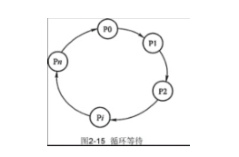
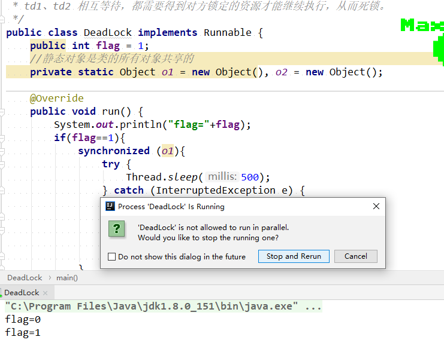
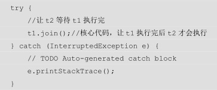
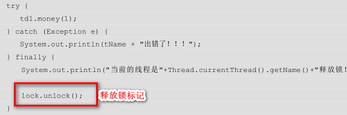

# 死锁的定义

所谓死锁是指多个线程因竞争资源而造成的一种僵局（互相等待），若无外力作用，这些进程都将无法向前推进。


# 死锁产生的必要条件

互斥条件：线程要求对所分配的资源（如打印机）进行排他性控制，即在一段时间内某资源仅为一个线程所占有。此时若有线程请求该资源，则请求线程只能等待。

不剥夺条件：线程所获得的资源在未使用完毕之前，不能被其他线程倾向夺走，即只能由获得该资源的线程自己来释放（只能是主动释放）。

请求和保持条件：线程已经保持了至少一个资源，但又提出了新的资源请求，而该线程已被其他线程占有，此时请求进程被阻塞，但对自己已获得的资源保持不放。

循环等待条件：存在一种线程资源的循环等待链，链中每一个线程已获得的资源同时被链中下一个线程所请求。即存在一个处于等待状态的线程集合{P1,P2,...,Pn}，其中Pi等待的资源被P(i+1)占有(i=0,1,..,n-1)，Pn等待的资源被P0占有，如下图。

[](https://img2018.cnblogs.com/common/1403839/201911/1403839-20191121095354550-59213531.png)


# 产生死锁的一个例子


```java
/**
 * 一个简单的死锁类
 * 当DeadLock类的对象flag==1时(td1)，先锁定o1，睡眠500ms
 * 而td1在睡眠的时候另一个flag==0的对象(td2)线程启动，先锁定o2，睡眠500ms
 * td1 睡眠结束后需要锁定 o2 才能继续执行，而此时 o2 已被 td2 锁定；
 * td2 睡眠结束后需要锁定 o1 才能继续执行，而此时 o1 已被 td1 锁定；
 * td1、td2 相互等待，都需要得到对方锁定的资源才能继续执行，从而死锁。
 */
public class DeadLock implements Runnable {
    public int flag = 1;
    //静态对象是类的所有对象共享的
    private static Object o1 = new Object(), o2 = new Object();

    @Override
    public void run() {
        System.out.println("flag="+flag);
        if(flag==1){
            synchronized (o1){
                try {
                    Thread.sleep(500);
                } catch (InterruptedException e) {
                    e.printStackTrace();
                }
                synchronized (o2){
                    System.out.println("1");
                }
            }
        }
        if(flag==0){
            synchronized (o2){
                try {
                    Thread.sleep(500);
                } catch (InterruptedException e) {
                    e.printStackTrace();
                }
                synchronized (o1){
                    System.out.println("0");
                }
            }
        }
    }
    public static void main(String[] args) {
        DeadLock td1 = new DeadLock();
        DeadLock td2 = new DeadLock();
        td1.flag=1;
        td2.flag=0;
        //td1，td2都处于可执行状态，但JVM线程调度先执行哪个线程是不确定的。
        //td2的run()可能在td1的run()之前运行
        new Thread(td1).start();
        new Thread(td2).start();
    }
}
```





# 如何避免死锁

在有些情况下死锁是可以避免的。

两种用于避免死锁的技术：

1）加锁顺序（线程按照一定的顺序加锁）





2）加锁时限（线程获取锁的时候加上一定的时限，超过时限则放弃对该锁的请求，并释放自己占有的锁）


