这两面试题是基友朋友最近去面滴滴遇到的，今天就借着这俩面试真题来深入一波线程池吧，这篇文章力求把线程池核心点和常问的面试点一网打尽，当然个人能力有限，可能会有遗漏，欢迎留言补充！

先把问题列出来，如果你都答得出来，那没必要看下去：

- 为什么会有线程池？
- 简单手写一个线程池？
- 为什么要把任务先放在任务队列里面，而不是把线程先拉满到最大线程数？
- 线程池如何动态修改核心线程数和最大线程数？
- 如果你是 JDK 设计者，如何设计？
- 如果要让你设计一个线程池，你要怎么设计？
- 你是如何理解核心线程的？
- 你是怎么理解 KeepAliveTime 的？
- 那 workQueue 有什么用？
- 你是如何理解拒绝策略的？
- 你说你看过源码，那你肯定知道线程池里的 ctl 是干嘛的咯？
- 你知道线程池有几种状态吗？
- 你知道线程池的状态是如何变迁的吗？
- 如何修改原生线程池，使得可以先拉满线程数再入任务队列排队？
- Tomcat 中的定制化线程池实现 如果线程池中的线程在执行任务的时候，抛异常了，会怎么样？
- 原生线程池的核心线程一定伴随着任务慢慢创建的吗？
- 线程池的核心线程在空闲的时候一定不会被回收吗？

接得住吗？话不多说，发车！

# 为什么会有线程池？

想要深入理解线程池的原理得先知道为什么需要线程池。

首先你要明白，线程是一个重资源，JVM 中的线程与操作系统的线程是一对一的关系，所以在 JVM 中每创建一个线程就需要调用操作系统提供的 API 创建线程，赋予资源，并且销毁线程同样也需要系统调用。

而系统调用就意味着上下文切换等开销，并且线程也是需要占用内存的，而内存也是珍贵的资源。

因此线程的创建和销毁是一个重操作，并且线程本身也占用资源。

然后你还需要知道，线程数并不是越多越好。

我们都知道线程是 CPU 调度的最小单位，在单核时代，如果是纯运算的操作是不需要多线程的，一个线程一直执行运算即可。但如果这个线程正在等待 I/O 操作，此时 CPU 就处于空闲状态，这就浪费了 CPU 的算力，因此有了多线程，在某线程等待 I/O 等操作的时候，另一个线程顶上，充分利用 CPU，提高处理效率。

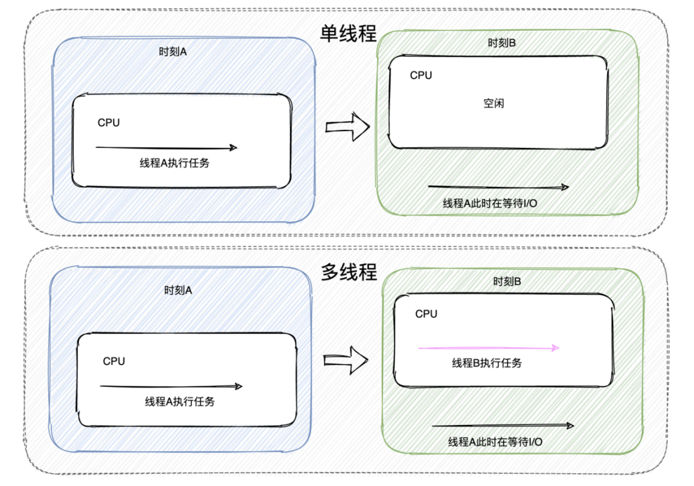

此时的多线程主要是为了提高 CPU 的利用率而提出。

而随着 CPU 的发展，核心数越来越多，能同时运行的线程数也提升了，此时的多线程不仅是为了提高单核 CPU 的利用率，也是为了充分利用多个核心。

至此想必应该明白了为什么会有多线程，无非就是为了充分利用 CPU 空闲的时间，一刻也不想让它停下来。

但 CPU 的核心数有限，同时能运行的线程数有限，所以需要根据调度算法切换执行的线程，而线程的切换需要开销，比如替换寄存器的内容、高速缓存的失效等等。

如果线程数太多，切换的频率就变高，可能使得多线程带来的好处抵不过线程切换带来的开销，得不偿失。

因此线程的数量需要得以控制，结合上述的描述可知，线程的数量与 CPU 核心数和 I/O 等待时长息息相关。

小结一下：

- Java 中线程与操作系统线程是一比一的关系。
- 线程的创建和销毁是一个“较重”的操作。
- 多线程的主要是为了提高 CPU 的利用率。
- 线程的切换有开销，线程数的多少需要结合 CPU 核心数与 I/O 等待占比。

综上我们知道了线程的这些特性，所以说它不是一个可以“随意拿捏”的东西，我们需要重视它，好好规划和管理它，充分利用硬件的能力，从而提升程序执行效率，所以线程池应运而生。

# 什么是线程池？

那我们要如何管理好线程呢？

因为线程数太少无法充分利用 CPU ，太多的话由于上下文切换的消耗又得不偿失，所以我们需要评估系统所要承载的并发量和所执行任务的特性，得出大致需要多少个线程数才能充分利用 CPU，因此需要控制线程数量。

又因为线程的创建和销毁是一个“重”操作，所以我们需要避免线程频繁地创建与销毁，因此我们需要缓存一批线程，让它们时刻准备着执行任务。

目标已经很清晰了，弄一个池子，里面存放约定数量的线程，这就是线程池，一种池化技术。

熟悉对象池、连接池的朋友肯定对池化技术不陌生，一般池化技术的使用方式是从池子里拿出资源，然后使用，用完了之后归还。

但是线程池的实现不太一样，不是说我们从线程池里面拿一个线程来执行任务，等任务执行完了之后再归还线程，你可以想一下这样做是否合理。

线程池的常见实现更像是一个黑盒存在，我们设置好线程池的大小之后，直接往线程池里面丢任务，然后就不管了。

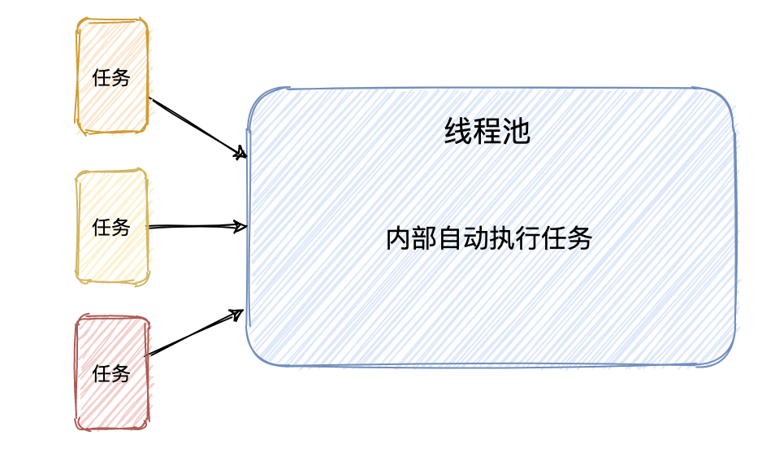

剥开来看，线程池其实是一个典型的生产者-消费者模式。

线程池内部会有一个队列来存储我们提交的任务，而内部线程不断地从队列中索取任务来执行，这就是线程池最原始的执行机制。

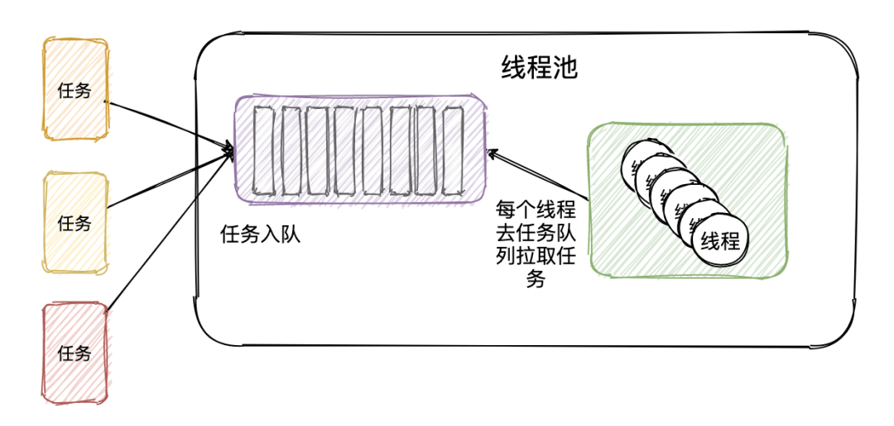

按照这个思路，我们可以很容易的实现一个简单版线程池，想必看了下面这个代码实现，对线程池的核心原理就会了然于心。

首先线程池内需要定义两个成员变量，分别是阻塞队列和线程列表，然后自定义线程使它的任务就是不断的从阻塞队列中拿任务然后执行。

```java
@Slf4j
public class YesThreadPool {

    BlockingQueue<Runnable> taskQueue;  //存放任务的阻塞队列
    List<YesThread> threads; //线程列表

    YesThreadPool(BlockingQueue<Runnable> taskQueue, int threadSize) {
        this.taskQueue = taskQueue;
        threads = new ArrayList<>(threadSize);
        // 初始化线程，并定义名称
        IntStream.rangeClosed(1, threadSize).forEach((i)-> {
            YesThread thread = new YesThread("yes-task-thread-" + i);
            thread.start();
            threads.add(thread);
        });
    }
    //提交任务只是往任务队列里面塞任务
    public void execute(Runnable task) throws InterruptedException {
        taskQueue.put(task);
    }

    class YesThread extends Thread { //自定义一个线程
        public YesThread(String name) {
            super(name);
        }
        @Override
        public void run() {
            while (true) { //死循环
                Runnable task = null;
                try {
                    task = taskQueue.take(); //不断从任务队列获取任务
                } catch (InterruptedException e) {
                    log.error("记录点东西.....", e);
                }
                task.run(); //执行
            }
        }
    }
}
```

一个简单版线程池就完成了，简单吧！

再写个 main 方法用一用，丝滑，非常丝滑。

```java
 public static void main(String[] args) {
     YesThreadPool pool = new YesThreadPool(new LinkedBlockingQueue<>(10), 3);
     IntStream.rangeClosed(1, 5).forEach((i)-> {
         try {
             pool.execute(()-> {
                 System.out.println(Thread.currentThread().getName() + " 公众号：yes的练级攻略");
             });
         } catch (InterruptedException e) {
             log.error("记录点东西.....", e);
         }
     });
 }
```

运行结果如下：

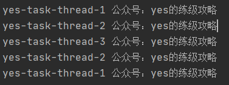

下次面试官让你手写线程池，直接上这个简单版，然后他会开始让你优化，比如什么线程一开始都 start 了不好，想懒加载，然后xxxx...最终其实就是想往李老爷实现的 ThreadPoolExecutor 上面靠。

那就来嘛。

# ThreadPoolExecutor 剖析

这玩意就是常被问的线程池的实现类了，先来看下构造函数：

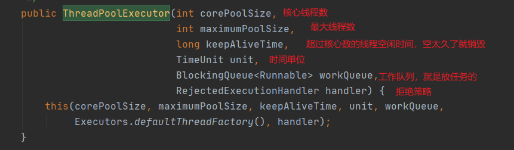

核心原理其实和咱们上面实现的差不多，只是生产级别的那肯定是要考虑的更多，接下来我们就来看看此线程池的工作原理。

先来一张图：

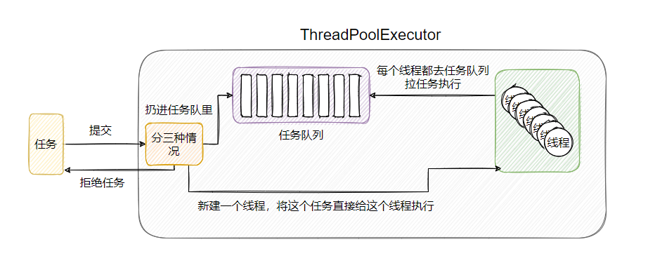

简单来说线程池把任务的提交和任务的执行剥离开来，当一个任务被提交到线程池之后：

- 如果此时线程数小于核心线程数，那么就会新起一个线程来执行当前的任务。
- 如果此时线程数大于核心线程数，那么就会将任务塞入阻塞队列中，等待被执行。
- 如果阻塞队列满了，并且此时线程数小于最大线程数，那么会创建新线程来执行当前任务。
- 如果阻塞队列满了，并且此时线程数大于最大线程数，那么会采取拒绝策略。

以上就是任务提交给线程池后各种状况汇总，一个很容易出现理解错误的地方就是当线程数达到核心数的时候，任务是先入队，而不是先创建最大线程数。

从上述可知，线程池里的线程不是一开始就直接拉满的，是根据任务量开始慢慢增多的，这就算一种懒加载，到用的时候再创建线程，节省资源。

来先吃我几问。

> 此时线程数小于核心线程数，并且线程都处于空闲状态，现提交一个任务，是新起一个线程还是给之前创建的线程？

李老是这样说的：`If fewer than corePoolSize threads are running, try to start a new thread with the given command as its first task.`

我觉得把 `threads are running` 去了，更合理一些，此时线程池会新起一个线程来执行这个新任务，不管老线程是否空闲。

> 你是如何理解核心线程的 ?

从上一个问题可以看出，线程池虽说默认是懒创建线程，但是它实际是想要快速拥有核心线程数的线程。核心线程指的是线程池承载日常任务的中坚力量，也就是说本质上线程池是需要这么些数量的线程来处理任务的，所以在懒中又急着创建它。

而最大线程数其实是为了应付突发状况。

举个装修的例子，正常情况下施工队只要 5 个人去干活，这 5 人其实就是核心线程，但是由于工头接的活太多了，导致 5 个人在约定工期内干不完，所以工头又去找了 2 个人来一起干，所以 5 是核心线程数，7 是最大线程数。

平时就是 5 个人干活，特别忙的时候就找 7 个，等闲下来就会把多余的 2 个辞了。

看到这里你可能会觉得核心线程在线程池里面会有特殊标记？

并没有，不论是核心还是非核心线程，在线程池里面都是一视同仁，当淘汰的时候不会管是哪些线程，反正留下核心线程数个线程即可，下文会作详解。

> 你是怎么理解 KeepAliveTime 的？

这就是上面提到的，线程池其实想要的只是核心线程数个线程，但是又预留了一些数量来预防突发状况，当突发状况过去之后，线程池希望只维持核心线程数的线程，所以就弄了个 KeepAliveTime，当线程数大于核心数之后，如果线程空闲了一段时间（KeepAliveTime），就回收线程，直到数量与核心数持平。

> 那 workQueue 有什么用？

缓存任务供线程获取，这里要注意限制工作队列的大小。队列长了，堆积的任务就多，堆积的任务多，后面任务等待的时长就长。

想想你点击一个按钮是一直转圈等半天没反应舒服，还是直接报错舒服，所以有时心是好的，想尽量完成提交的任务，但是用户体验不如直接拒绝。更有可能由于允许囤积的任务过多，导致资源耗尽而系统崩溃。

所以工作队列起到一个缓冲作用，具体队列长度需要结合线程数，任务的执行时长，能承受的等待时间等。

> 你是如何理解拒绝策略的？

线程数总有拉满的一天，工作队列也是一样，如果两者都满了，此时的提交任务就需要拒绝，默认实现是 AbortPolicy 直接抛出异常。

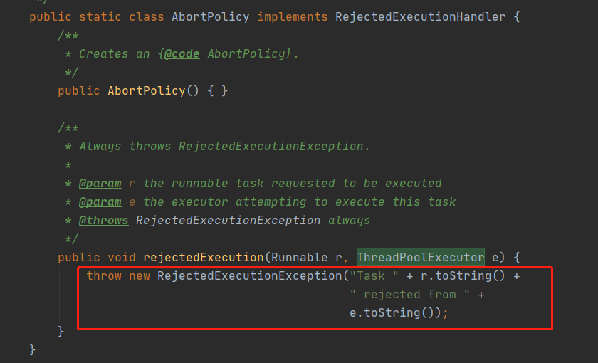

剩下的拒绝策略有直接丢弃任务一声不吭的、让提交任务的线程自己运行的、淘汰老的未执行的任务而空出位置的，具体用哪个策略，根据场景选择。当然也可以自定义拒绝策略，实现 `RejectedExecutionHandler` 这个接口即可。

所以线程池尽可能只维护核心数量的线程，提供任务队列暂存任务，并提供拒绝策略来应对过载的任务。

这里还有个细节，如果线程数已经达到核心线程数，那么新增加的任务只会往任务队列里面塞，不会直接给予某个线程，如果任务队列也满了，新增最大线程数的线程时，任务是可以直接给予新建的线程执行的，而不是入队。

感觉已经会了？那再来看几道面试题：

> 你说你看过源码，那你肯定知道线程池里的 ctl 是干嘛的咯？

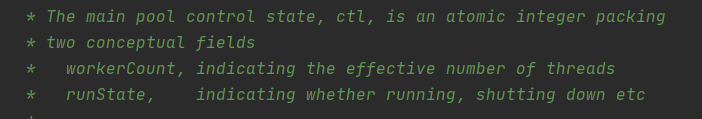

其实看下注释就很清楚了，ctl 是一个涵盖了两个概念的原子整数类，它将工作线程数和线程池状态结合在一起维护，低 29 位存放 workerCount，高 3 位存放 runState。

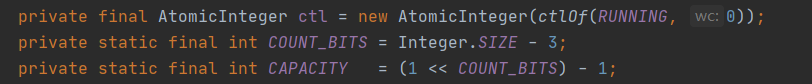

其实并发包中有很多实现都是一个字段存多个值的，比如读写锁的高 16 位存放读锁，低 16 位存放写锁，这种一个字段存放多个值可以更容易的维护多个值之间的一致性，也算是极简主义。

> 你知道线程池有几种状态吗？

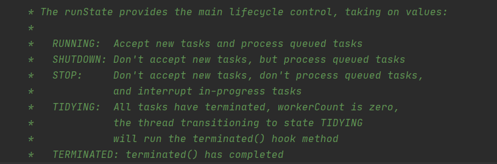

注解说的很明白，我再翻译一下：

- RUNNING：能接受新任务，并处理阻塞队列中的任务
- SHUTDOWN：不接受新任务，但是可以处理阻塞队列中的任务
- STOP：不接受新任务，并且不处理阻塞队列中的任务，并且还打断正在运行任务的线程，就是直接撂担子不干了！
- TIDYING：所有任务都终止，并且工作线程也为0，处于关闭之前的状态
- TERMINATED：已关闭。

> 你知道线程池的状态是如何变迁的吗？

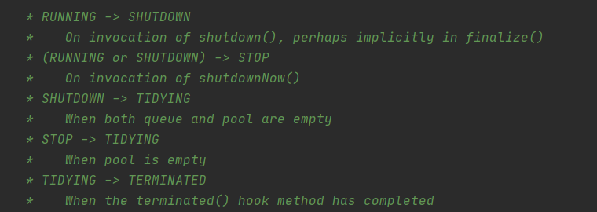

注释里面也写的很清楚，我再画个图

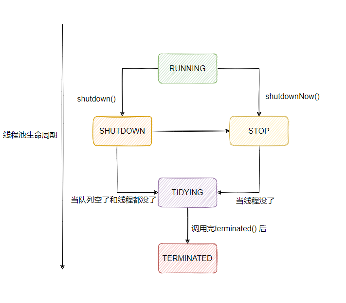

> 为什么要把任务先放在任务队列里面，而不是把线程先拉满到最大线程数？

我说下我的个人理解。

其实经过上面的分析可以得知，线程池本意只是让核心数量的线程工作着，不论是 core 的取名，还是 keepalive 的设定，所以你可以直接把 core 的数量设为你想要线程池工作的线程数，而任务队列起到一个缓冲的作用。最大线程数这个参数更像是无奈之举，在最坏的情况下做最后的努力，去新建线程去帮助消化任务。

所以我个人觉得没有为什么，就是这样设计的，并且这样的设定挺合理。

当然如果你想要扯一扯 CPU 密集和 I/O 密集，那可以扯一扯。

原生版线程池的实现可以认为是偏向 CPU 密集的，也就是当任务过多的时候不是先去创建更多的线程，而是先缓存任务，让核心线程去消化，从上面的分析我们可以知道，当处理 CPU 密集型任务的时，线程太多反而会由于线程频繁切换的开销而得不偿失，所以优先堆积任务而不是创建新的线程。

而像 Tomcat 这种业务场景，大部分情况下是需要大量 I/O 处理的情况就做了一些定制，修改了原生线程池的实现，使得在队列没满的时候，可以创建线程至最大线程数。

> 如何修改原生线程池，使得可以先拉满线程数再入任务队列排队？

如果了解线程池的原理，很轻松的就知道关键点在哪，就是队列的 offer 方法。


execute 方法想必大家都不陌生，就是给线程池提交任务的方法。在这个方法中可以看到只要在 offer 方法内部判断此时线程数还小于最大线程数的时候返回 false，即可走下面 `else if` 中 `addWorker` (新增线程)的逻辑，如果数量已经达到最大线程数，直接入队即可。

详细的我们可以看看 Tomcat 中是如何定制线程的。

> Tomcat 中的定制化线程池实现

```java
public class ThreadPoolExecutor extends java.util.concurrent.ThreadPoolExecutor {}
```

可以看到先继承了 JUC 的线程池，然后我们重点关注一下 execute 这个方法

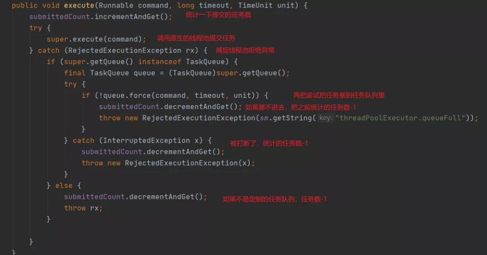

这里可以看到，Tomcat 维护了一个 submittedCount 变量，这个变量的含义是统计已经提交的但是还未完成的任务数量(记住这个变量，很关键)，所以只要提交一个任务，这个数就加一，并且捕获了拒绝异常，再次尝试将任务入队，这个操作其实是为了尽可能的挽救回一些任务，因为这么点时间差可能已经执行完很多任务，队列腾出了空位，这样就不需要丢弃任务。

然后我们再来看下代码里出现的 TaskQueue，这个就是上面提到的定制关键点了。

```java
public class TaskQueue extends LinkedBlockingQueue<Runnable> {
    private transient volatile ThreadPoolExecutor parent = null;
    ........
}
```

可以看到这个任务队列继承了 LinkedBlockingQueue，并且有个 ThreadPoolExecutor 类型的成员变量 parent ，我们再来看下 offer 方法的实现，这里就是修改原来线程池任务提交与线程创建逻辑的核心了。

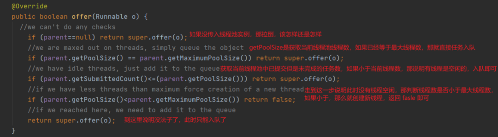

从上面的逻辑可以看出是有机会在队列还未满的时候，先创建线程至最大线程数的！

再补充一下，如果对直接返回 false 就能创建线程感到疑惑的话，往上翻一翻，上面贴了原生线程池 execute 的逻辑。

然后上面的代码其实只看到 submittedCount 的增加，正常的减少在 `afterExecute` 里实现了。

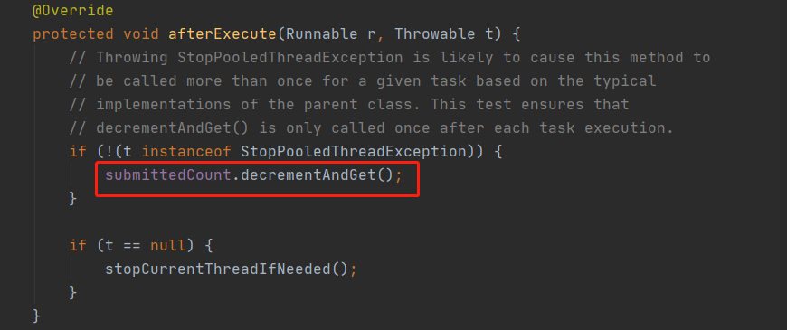

而这个 `afterExecute` 在任务执行完毕之后就会调用，与之对应的还有个 `beforeExecute`，在任务执行之前调用。

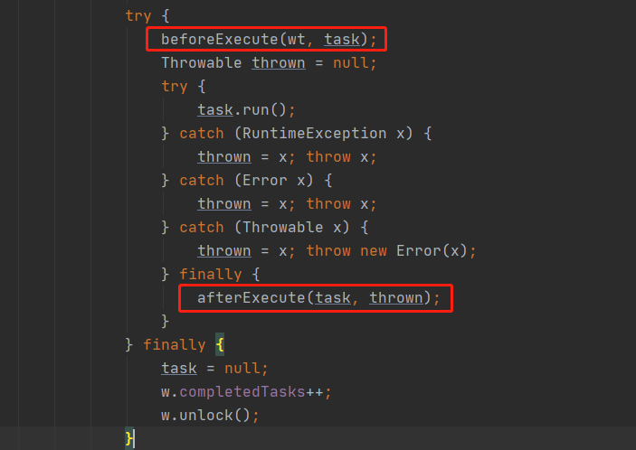

至此，想必 Tomcat 中的定制化线程池的逻辑已经明白了。

> 如果线程池中的线程在执行任务的时候，抛异常了，会怎么样？

嘿嘿，细心的同学想必已经瞄到了上面的代码，task.run() 被 `try catch finally` 包裹，异常被扔到了 `afterExecute` 中，并且也继续被抛了出来。

而这一层外面，还有个`try finally`，所以异常的抛出打破了 while 循环，最终会执行 `processWorkerExit` 方法

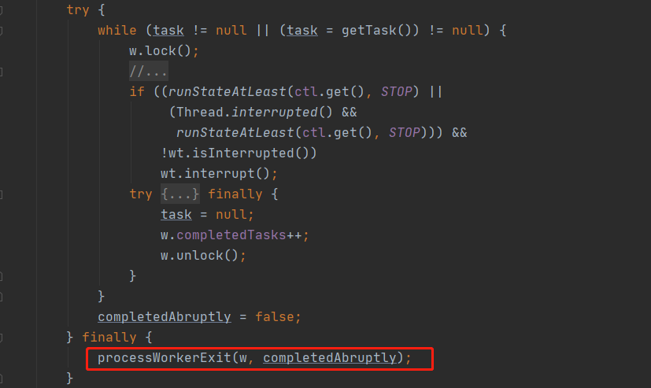

我们来看下这个方法，其实逻辑很简单，把这个线程废了，然后新建一个线程替换之。

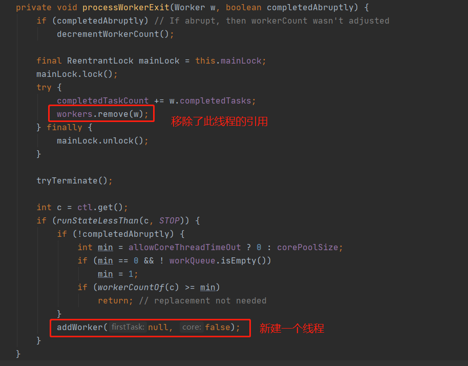

移除了引用等于销毁了，这事儿 GC 会做的。

所以如果一个任务执行一半就抛出异常，并且你没有自行处理这个异常，那么这个任务就这样戛然而止了，后面也不会有线程继续执行剩下的逻辑，所以要自行捕获和处理业务异常。

addWorker 的逻辑就不分析了，就是新建一个线程，然后塞到 workers 里面，然后调用 `start()` 让它跑起来。

> 原生线程池的核心线程一定伴随着任务慢慢创建的吗？

并不是，线程池提供了两个方法：

- prestartCoreThread：启动一个核心线程
- prestartAllCoreThreads ：启动所有核心线程

不要小看这个预创建方法，预热很重要，不然刚重启的一些服务有时是顶不住瞬时请求的，就立马崩了，所以有预热线程、缓存等等操作。

> 线程池的核心线程在空闲的时候一定不会被回收吗？

有个 allowCoreThreadTimeOut 方法，把它设置为 true ，则所有线程都会超时，不会有核心数那条线的存在。

具体是会调用 `interruptIdleWorkers` 这个方法。

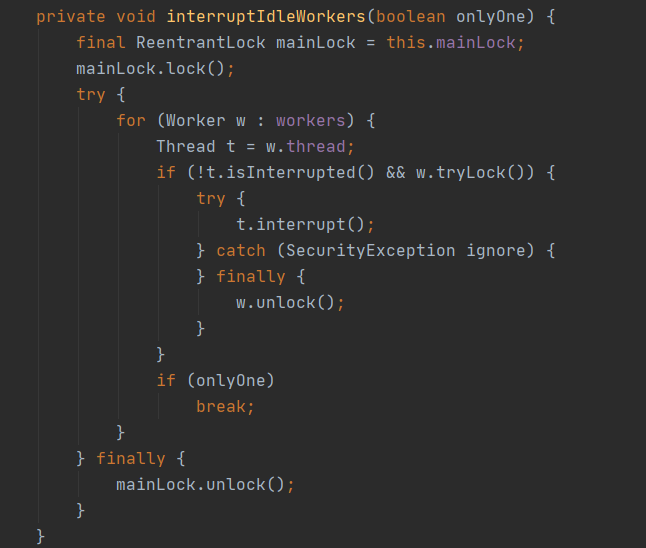

这里需要讲一下的是 w.tryLock() 这个方法，有些人可能会奇怪，Worker 怎么还能 lock。

Worker 是属于工作线程的封装类，它不仅实现了 Runnable 接口，还继承了 AQS。


之所以要继承 AQS 就是为了用上 lock 的状态，执行任务的时候上锁，任务执行完了之后解锁，这样执行关闭线程池等操作的时候可以通过 tryLock 来判断此时线程是否在干活，如果 tryLock 成功说明此时线程是空闲的，可以安全的回收。

与 `interruptIdleWorkers` 对应的还有一个  `interruptWorkers` 方法，从名字就能看出差别，不空闲的 worker 也直接给打断了。

根据这两个方法，又可以扯到 shutdown 和 shutdownNow，就是关闭线程池的方法，一个是安全的关闭线程池，会等待任务都执行完毕，一个是粗暴的直接咔嚓了所有线程，管你在不在运行，两个方法分别调用的就是 interruptIdleWorkers() 和 interruptWorkers() 来中断线程。

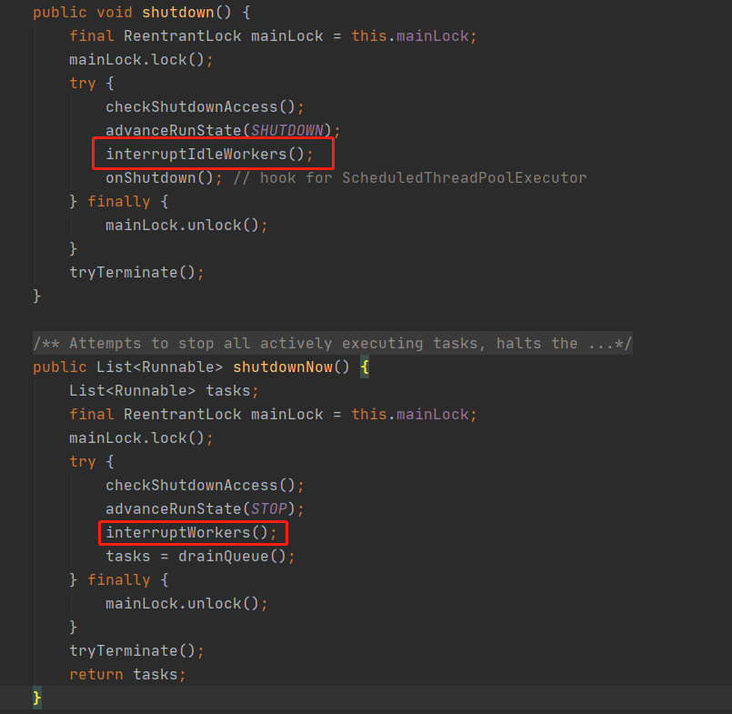

这又可以引申出一个问题，shutdownNow 了之后还在任务队列中的任务咋办？眼尖的小伙伴应该已经看到了，线程池还算负责，把未执行的任务拖拽到了一个列表中然后返回，至于怎么处理，就交给调用者了！

详细就是上面的 drainQueue 方法。

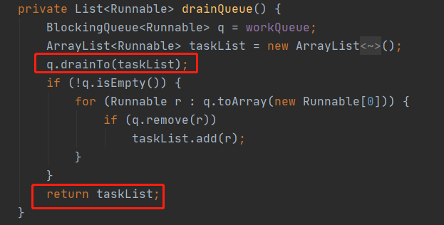

这里可能又会有同学有疑问，都 drainTo 了，为什么还要判断一下队列是否为空，然后进行循环？

那是因为如果队列是 DelayQueue 或任何其他类型的队列，其中 poll 或 drainTo 可能无法删除某些元素，所以需要遍历，逐个删除它们。

# 回到最开始的面试题

> 线程池如何动态修改核心线程数和最大线程数？

其实之所以会有这样的需求是因为线程数是真的不好配置。

你可能会在网上或者书上看到很多配置公式，比如：

- **CPU 密集型**的话，核心线程数设置为 **CPU 核数 + 1**
- **I/O 密集型**的话，核心线程数设置为 **2 * CPU 核数**

比如：

**线程数 = CPU 核数 *（1 + 线程等待时间 / 线程时间运行时间**）

这个比上面的更贴合与业务，还有一些理想的公式就不列了。就这个公式而言，这个线程等待时间就很难测，拿 Tomcat 线程池为例，每个请求的等待时间能知道？不同的请求不同的业务，就算相同的业务，不同的用户数据量也不同，等待时间也不同。

所以说线程数真的很难通过一个公式一劳永逸，线程数的设定是一个迭代的过程，需要压测适时调整，以上的公式做个初始值开始调试是 ok 的。

再者，流量的突发性也是无法判断的，举个例子 1 秒内一共有 1000 个请求量，但是如果这 1000 个请求量都是在第一毫秒内瞬时进来的呢？

这就很需要线程池的动态性，也是这个上面这个面试题的需求来源。

原生的线程池核心我们大致都过了一遍，不过这几个方法一直没提到，先来看看这几个方法：

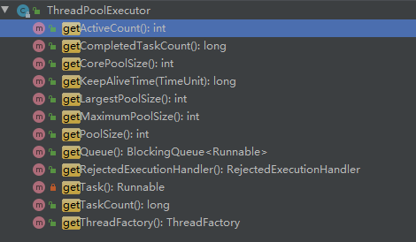

我就不一一翻译了，大致可以看出线程池其实已经给予方法暴露出内部的一些状态，例如正在执行的线程数、已完成的任务数、队列中的任务数等等。

当然你可以想要更多的数据监控都简单的，像 Tomcat 那种继承线程池之后自己加呗，动态调整的第一步监控就这样搞定了！定时拉取这些数据，然后搞个看板，再结合邮件、短信、钉钉等报警方式，我们可以很容易的监控线程池的状态！

接着就是动态修改线程池配置了。

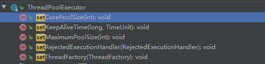

可以看到线程池已经提供了诸多修改方法来更改线程池的配置，所以李老都已经考虑到啦！

同样，也可以继承线程池增加一些方法来修改，看具体的业务场景了。同样搞个页面，然后给予负责人员配置修改即可。

所以原生线程池已经提供修改配置的方法，也对外暴露出线程池内部执行情况，所以只要我们实时监控情况，调用对应的 set 方法，即可动态修改线程池对应配置。

回答面试题的时候一定要提监控，显得你是有的放矢的。

> 如果你是 JDK 设计者，如何设计？

其实我觉得这个是紧接着上一题问的，应该算是同一个问题。

而且 JDK 设计者已经设计好了呀？所以怎么说我也不清楚，不过我们可以说一说具体的实现逻辑呗。

先来看下设置核心线程数的方法：

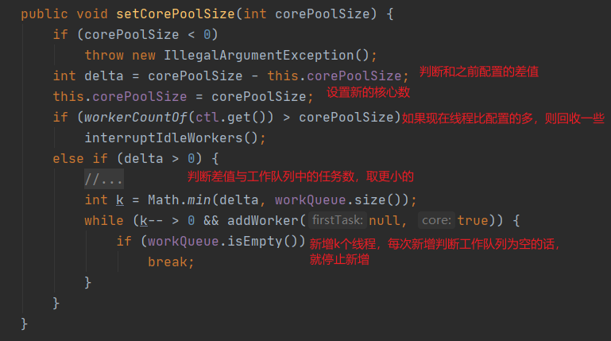

随着注释看下来应该没什么问题，就是那个 k 值我说一下，李老觉得核心线程数是配置了，但是此时线程池内部是否需要这么多线程是不确定的，那么就按工作队列里面的任务数来，直接按任务数立刻新增线程，当任务队列为空了之后就终止新增。

这其实和李老设计的默认核心线程数增加策略是一致的，都是懒创建线程。

再看看设置最大线程数的方法：


没啥花头，调用的 `interruptIdleWorkers` 之前都分析过了。

我再贴一下之前写过的线程池设计面试题吧。

> 如果要让你设计一个线程池，你要怎么设计？

这种设计类问题还是一样，先说下理解，表明你是知道这个东西的用处和原理的，然后开始 BB。基本上就是按照现有的设计来说，再添加一些个人见解。

线程池讲白了就是存储线程的一个容器，池内保存之前建立过的线程来重复执行任务，减少创建和销毁线程的开销，提高任务的响应速度，并便于线程的管理。

我个人觉得如果要设计一个线程池的话得考虑池内工作线程的管理、任务编排执行、线程池超负荷处理方案、监控。

初始化线程数、核心线程数、最大线程池都暴露出来可配置，包括超过核心线程数的线程空闲消亡配置。

任务的存储结构可配置，可以是无界队列也可以是有界队列，也可以根据配置分多个队列来分配不同优先级的任务，也可以采用 stealing 的机制来提高线程的利用率。

再提供配置来表明此线程池是 IO 密集还是 CPU 密集型来改变任务的执行策略。

超负荷的方案可以有多种，包括丢弃任务、拒绝任务并抛出异常、丢弃最旧的任务或自定义等等。

线程池埋好点暴露出用于监控的接口，如已处理任务数、待处理任务数、正在运行的线程数、拒绝的任务数等等信息。

我觉得基本上这样答就差不多了，等着面试官的追问就好。

注意不需要跟面试官解释什么叫核心线程数之类的，都懂的没必要。

当然这种开放型问题还是仁者见仁智者见智，我这个不是标准答案，仅供参考。

> 关于线程池的一点碎碎念

线程池的好处我们都知道了，但是不是任何时刻都上线程池的，我看过一些奇怪的代码，就是为了用线程池而用线程池...

还有需要根据不同的业务划分不同的线程池，不然会存在一些耗时的业务影响了另一个业务导致这个业务崩了，然后都崩了的情况，所以要做好线程池隔离。

# 最后

好了，有关线程池的知识点和一些常见的一些面试题应该都涉及到了吧，如果还有别的啥角度刁钻的面试题，欢迎留言提出，咱们一起研究研究。

相信看了这篇文章之后，关于线程池出去面试可以开始吹了！