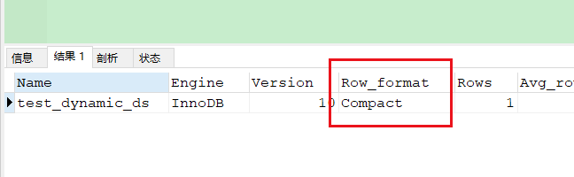
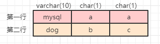
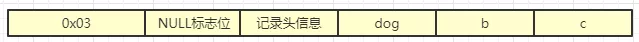
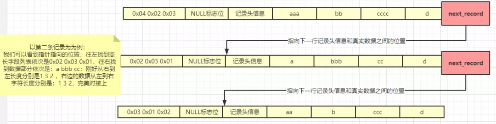
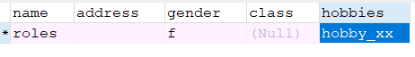

# MySQL 数据是如何存储在上存储的？

关于 MySQL 数据库，相信很多人都不陌生，这是当今最常用的一种关系型数据库，关于 MySQL 的知识也是很丰富的。

那么，不知道大家有没有想过这样的问题：MySQL 中的数据是存在哪的？又是如何存储的呢？

本文就来深入分析一下这些问题。文章内容很长，建议收藏，建议大家静下心来仔细阅读，一定会有收获！


## InnoDB 的存储格式

我们知道，关于 MySQL 这种关系型数据库，里面保存的数据最终都是要持久化到磁盘文件上面的。磁盘文件里存放的物理格式就是数据页（关于数据页，如果不太理解先忽略，后续文章单独介绍），数据页中存放的是一行一行的记录，但是对于数据页中的每一行数据他又是怎么存储的呢？

我们拿 MySQL 中最常用的 InnoDB 引擎来重点说，介绍下存储格式是怎样的。

MySQL 中存储有 3 种：

1. server 层格式：与存储引擎无关，Binlog 存储常用的一种 (Binlog 我们前面已经详细介绍过了，这个是 MySQL 主从复制的一个很重要的文件)
2. 索引元组格式：InnoDB 存取过程记录的中间状态，是 InnoDB 在内存中存储的格式 （换句话说我们的增删改的操作都是在内存中执行的，这个只是一种临时状态）
3. 物理存储格式：记录在物理页面中的存储格式，即 compact 格式，与索引元组格式一一对应。（这个是数据在磁盘存储的真正的格式）

MySQL 的 InnoDB 存储引擎和大多数数据库一样，都是以行的形式存储数据的，我们可以通过`SHOW TABLE STATUS`查看到行的的存储格式。

InnoDB 储存引擎支持有四种行储存格式：COMPACT、Redundant、Dynamic 和 COMPRESSED。默认为 COMPACT。



其他的参数我们这里不关注，仅仅看 Row_format 这列，这里我们可以看到行的存储格式是 Compact，Compact 存储数据的格式大致如下这样


对于我们看到的每一行数据，我们最先看到的好像并不是各个列，而是一些类似列的描述信息。没错，其实在存储的时候都会有一些都字段来描述这一行的信息，这就好比缓存池中的描述缓存页的描述数据类似。

上面的图片大家可以这么简化来对待，**事务 ID** 和**回滚指针**大家先不要关注，免得因为这个产生干扰而难于理解


## 变长字段 varchar 是如何存储的

一般情况下，我们要存储的数据是并不能确定他的长度的，大部分情况下都是一些变长的数据，以`varchar`为例，假设现在三个字段，字段类型分别为：`varchar(10)`，`char(1)`，`char(1)`，`char`大家都是知道的，存储的基本是一些已知的长度固定的数据，假设这三个类型的字段分别有如下的数据：

第一行：`mysql` `a` `a`；

第二行：`dog` `b` `c`；

画个图来帮助大家想象，现在你看到的是数据中为我们展现的样子。



但是在磁盘中可不是这样子的，前文已经提到过，表空间和行这些其实是逻辑上的概念，而数据页是一种物理概念，也就是说我们看到的样子在磁盘中的样子本本是不一样的。

在磁盘中这两条记录大致是这样子的：

`mysql` `a` `a` 

`dog` `b` `c`

他们在磁盘中都是挨在一起存储的。

是不是瞬间感觉想要去查找一条数据非常麻烦，告诉你：是的，所以 MySQL 在设计的时候才会使用行格式存储，才会有前面的哪些变长字段列表和标志位以及记录信息，这些就是用来记录一行的记录的信息，换句话说，MySQL 是通过这些描述信息来定位到一行中的具体记录的。

以第一行记录为例，它在磁盘中的记录情况大致是下面这样子的，首先我们需要明确知道的是各个字段的类型 MySQL 是很清楚的，在这个基础上我们能看明白下面和想通后面的事情。首先我们看到 MySQL 是 5 个字符，使用十六进制表示是 0x05，所以他的存储大概是这样子的：


同理第二行数据类似这样子的：



相信大家在看到这里已经大概能推测出 MySQL 这个时候是怎么读读取数据的了，就是它会先根据变长字段长度列表中描述的变长字段的信息去查找变长字段，例如第一行，MySQL 解析到变长字段是 5，所以它会在`mysql` `a` `a` `dog` `b` `c` 这些里面取出 5 个字符，也就是 `mysql`，紧接着后面是两个 char(1) 也就是两个 `a` 在依次取出来。

> 中间设备。由浅入深，我们慢慢来，刚刚上面说到的仅仅是一种非常简单的情况，这个首先是帮助大家理解，让大家先明白有这么个回事，是这么回事，然后在慢慢的挖掘，我们一定要一个萝卜一个坑的去踏实学习

现在如果是多个`varchar`类型的字段怎么办？例如：`varchar(3)`，`varchar(10)`，`varchar(4)`，`char(1)`，有一条记录是这样子的：`aaa`,`bb`,`cccc`,`d`，你根据上面的能推测出磁盘中的行记录是怎么样子的吗？

你是不是这么想的：磁盘中肯定是这样的：`0x03,0x02,0x04` null 标志位 记录头信息 `aaa` `bb` `cccc` `d`；

这么想的同学请鼻子靠墙 ：)

实际上并不是这样子的。

当有多个变长字段的时候，MySQL 在 compact 行格式中，把所有变长类型的长度存放在行记录的开头部位形成一个列表（这个列表就是刚刚上面说的变长字段列表），**按照列的逆序存放**，也就是大致是这样子的：


这里我必须要给大家解释下变长字段列表会逆序存放，因为每行记录的都有一个 `next_record` 指针 指向下一行 `记录头信息`和 `真实数据` 之间的位置。因为这个位置刚刚好，向左读取就是行描述相关信息，向右读取就是真实数据。正好对应变长字段长度列表。

画个图来帮助大家理解下：




说到这里我们来稍微小结一下


## MySQL 中数据在磁盘的存储小结

1. 数据在磁盘中的存储在物理空间上面是连续的
2. 数据是被存放在 MySQL 设计出来的数据页上面的，数据页上面存储的才是最终的一行一行的记录
3. 行的存储格式默认是 compact
4. 每一行数据都会有相应的行描述部分，描述部分有【变长字段列表】【NULL标志位】【记录头信息】
5. 每一行都会有 next_record 指针，指向记录头和变长字段列表的中间某个位置，方便寻址
6. 变长列表中的 varchar 列的描述是逆序的（和字段的顺序相反），这样做的目的在上图中描述的很清楚了


## NULL 字段是如何存储的

上面说到了情况都是比较正常的情况，也就说上面提到的字段是没有空值的，不管是变长字段还是 char 字段，都是有值的，那如果某个字段允许为空，且值确实为空，MySQL 又是怎么处理的呢？是不是直接存储 NULL 呢。

假设 MySQL 针对与 Null 直接存储，他实际上是按照 “NULL” 这样字符串的形式存储的，这样显然不行啊，因为字符串要占用空间的啊（一个 NULL 字符串要占用四个字符呢），你都没有值，还占这么多空间，所以 MySQL 肯定不是这样存储的。其实 MySQL 在处理 NULL 值的时候是会将它**通二进制来存储**的，且也是**逆序的**


## MySQL 是如何通过二进制来存储 NULL 值的?

上面的 Compact 格式数据中的【NULL 标志位（也可以叫 NULL 列表）】就是用来存储 NULL 值的。若有某个字段值为 null，将将其 bit 位置为 1 说明值为 NULL，bit 为 0 说明该字段值不为空。

是不是听了解释还是稀里糊涂的，别急，我画个图再来详细介绍下，先假设我们有一张 sutdents 表

```mysql
CREATE TABLE `students` (

  `name` varchar(10) NOT NULL,

  `address` varchar(255) DEFAULT NULL,

  `gender` char(1) DEFAULT NULL,

  `class` varchar(10) DEFAULT NULL,

  `hobbies` varchar(255) DEFAULT NULL,

  PRIMARY KEY (`name`)

) 
```

有这样一行记录



我们先看变长字段列表部分(记住是**逆序**存放的)：

roles 是长度为 5 记作：0x05；

address 为 null，不放在变长列表中

gender 是 char 类型，不放在变长列表中

class 为空，不放在变长列表中

hobby_xx 长度为8记作：0x08；所以变长列表的记录为：`0x08 0x05`

现在到了 NULL 标志位了：依旧是从右往左记录字段：

name 在设计的时候就是 not null，所示是不会出现在 NULL 标志位中（Null 标志为是用来记录字段可为 NULL 的字段，字段不可以为 NULL 的不是会被记录到 NULL 标志位的）

address 为 NULL 记作 1

gender 不为 null 记作 0

class 为 null 记作 1

hobbies 不为 null 记作 0；

所以按照字段的顺序结果就是：0101，但是 NULL 标志位是逆序的，所以 NULL 标志位存放的结果大概是这样子的：0101，高位补 0 即可。


我们来模拟读取下这条记录：**MySQL 对于字段的类型一定是已知的**（这个是在创建数据表的时候就已经定下来了），所以对于 name 这种 not null 的字段是不会去存放在 null 标志位的，下面是详细的读取步骤：

- name 字段是主键，不可能在 NULL 标志位中的，又因为 name 是 varchar 字段，所以就会去变长字段列中查找，找到值为 0x05 接着就会去字段列表中读取5个字符的长度，也就是 roles ，第一个字段读取成功；
- 接着是 address 字段，因为类型是 MySQL 已知的，又因为字段值为 null 所以就不需要去读取了，第二个字段读取结束；
- 接着是  gender 字段，是 char 类型的，直接拿到 f 就可以了；
- 下一个是 class 字段，因为是 null 所以根本不会去变长字段中查找；
- 最后一个是 hobbies 字段，因为不为 null ，又是第二个变长字段，这个时候就会去 变长字段列表中查找，结果定位到是 0x08 那就读取 8 个字符的长度出来，拿出来是 hobby_xx；

说到这里，关于一行记录的中的变长字段列表和 NULL 标志位具体是如何读取字段值的就给大家介绍完了，不知道大家看到以上内容脑子是不是会展现一条条行记录的描述信息。目前我们只需要了解 varchar 和 NULL 存储的基本就足够了，因为这两个表特殊，也是最经常使用的，其他的字段类型本篇暂且不展开讨论了。


上面的记录头的信息我们还没有讨论过，下面我们再详细介绍下记录头信息是什么。


## 记录头信息

记录头信息由 40 位的 bit 位组成，其各个位的划分和含义如下：


记录头的各个位的作用其实就已经说的很清楚了，一些概念现在还没法讲解，很多东西需要到索引的时候才能展开讲，这里大家需要明确的就是各个标志位的含义。


我认为对于记录头的了解到这里就足够了，各个标志位的含义明确了到这个程度就行了，至于更多的可能我们根本接触不到。这一小节就当是科普。


## 数据在磁盘上到底是怎么存储的

上面画过这样一张图：


之前说的是数据大致是这样子在磁盘中存储的：0x03 NULL 标志位 记录头信息 dog b c，但是实际上后面的列的数据并是不是我们看到的这个样子，磁盘在存储的时候是根据数据库指定的字符集编码存储起来的你以为可能是上面那样子存储的。

实际上可能是在样子的：0x03 NULL 标志位 记录头信息 1233 323 223，也就是说实际的数据在磁盘上存储根本不是我们人能认识的，后面的 1233 323 223 这几个是我乱写的，没什么含义，主要是想表明是计算在实际存储的时候是以特定的字符编码来存储的。

另外每一行数据在被存储的时候实际上还会有隐藏的字段，相信大家对这个应该不会陌生的，row_id 大家应该是知道的，哪怕自己没用过可能也是听过的，这个是数据库自己为我们的每一行记录生成的一个唯一的表示，如果我们没有为数据表指定主键字段，也没有指定 Unique key，那么这个时候数据库内部会帮我们维护一个自增长的 ROW_ID 字段作为主键。

还有一个隐藏字段就是 事务 ID 上面的第二张图上层画出来过，这个顾名思义了，就是和事务相关的一个字段属性字段名为 DB_TRX_ID，这个再详解到事务的时候再详细介绍；最后一个也是在上面的第二张图上画出来了，就是回滚指针 DB_ROLL_PTR，回滚也是事务使用到的概念，也是放在事务那边跟大家介绍。

现在再来整体回顾下一行记录在磁盘中的存储的结构大概是什么样子的：

`0x08 0x05` `00000101` `0000010100000000000000000000000000000010` `2113444` `232343`


说到了存储，我们顺便聊聊和存储相关的一个概念，行溢出。


## 行溢出

说到这里，不知道大家有没有想过一个问题，就是我们一直在说 MySQL 存储是以数据页的形式来存储的，然后数据页中记录的是一行行的记录，但是往往常规情况下不会有什么问题。

但是如果现在有一行记录非常大，因为数据页大小默认也就是 16KB，假设某张表里面有 text 字段也有 BLOB 字段，且这一行的记录的大小远远超过了一个数据页的大小 16KB，这种情况称之为行溢出。

MySQL 是怎么来处理这种行溢出的情况的呢？实际上很简单，一个数据页不够就使用多个数据页，数据页和数据页之间使用链表连起来，之所以能够使用链表连接因为数据页里面是包含了存放指针的 bit 位。对于**行溢出**的概念了解到这个程度就足够了。我们学习是有的放矢，不是什么都要去刨根问底的。


## 结束语

本片文章详细的介绍了 MySQL 存储数据的格式和数据具体在磁盘中是怎么存储的，被存储的数据又是怎么查找的，说白了很多事情都是已经是既定的规则，所谓既定的规则就是很对东西已经被更早的设计出来。

所以你在使用和了解的使用只需要按照被人的规则来执行，然后在此基础上深入了解下别人为什么这么设计？这样会更有助于我们掌握和理解某个知识点。